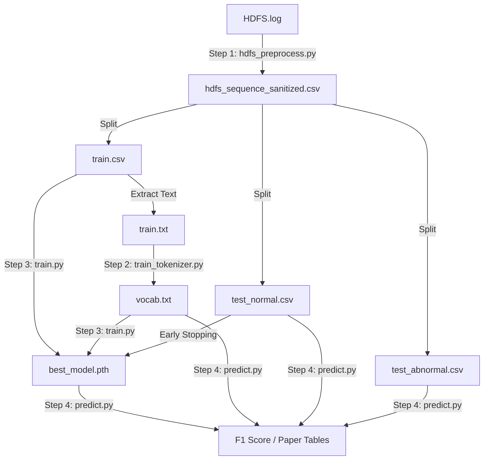

为了让你对整个实验流程的数据流向（Data Pipeline）一目了然，我将这些文件按**生成阶段**和**功能用途**进行了分类标注。

这些文件构成了你论文实验的完整证据链。

### 1. 核心产物 (The "Brain")
这是训练脚本最终生成的、价值最高的文件。

*   **`best_model.pth`**
    *   **来源**: `train.py` 在 Early Stopping 过程中保存的。
    *   **内容**: 包含两个关键对象：
        1.  `model_state_dict`: TinyBERT 的所有权重参数（已学会 HDFS 语法）。
        2.  `center`: 训练好的超球体中心向量（正常日志的“聚类中心”）。
    *   **用途**: **推理核心**。`predict.py` 将加载它来判断新日志离这个中心有多远。

### 2. 基础设施 (Infrastructure)
这是让 BERT 理解日志“语言”的字典。

*   **`vocab.txt`**
    *   **来源**: `train_tokenizer.py` (基于 `train.txt` 训练生成)。
    *   **内容**: 约 3000 行。每行一个 Token（如 `[BLK]`, `packet`, `##ponder`）。
    *   **用途**: **翻译官**。它负责把文本日志转换成数字 ID 序列。它是你“领域自适应（Domain Adaptation）”的核心证据。

### 3. 数据集划分 (Data Splits)
这是预处理脚本 `hdfs_preprocess.py` 将原始日志清洗并切分后的产物。

#### A. 训练组 (用于教模型什么是“正常”)
*   **`train.csv`**
    *   **内容**: 约 4855 条数据。**全都是正常样本 (Label=0)**。包含 `BlockId`, `EventSequence` 等列。
    *   **用途**: `train.py` 读取它进行训练。`train_tokenizer.py` 读取它建立词表。
*   **`train.txt`**
    *   **内容**: `train.csv` 的纯文本版本（去除了 BlockId 和表头）。
    *   **用途**: 专门喂给 `train_tokenizer.py` 的，因为 HuggingFace 的训练函数只吃纯文本。

#### B. 测试组 - 正常 (用于验证误报率 False Positive)
*   **`test_normal.csv`**
    *   **内容**: 未参与训练的正常样本。
    *   **用途**:
        1.  在 `train.py` 中作为 **验证集** (Validation Set) 指导 Early Stopping。
        2.  在 `predict.py` 中作为 **测试集**，模型**不应该**对它们报警。
*   **`test_normal.txt`**
    *   **内容**: 纯文本版本。
    *   **用途**: 兼容性备份，方便肉眼查看清洗效果。

#### C. 测试组 - 异常 (用于验证召回率 Recall)
*   **`test_abnormal.csv`**
    *   **内容**: HDFS 中所有的异常样本 (Label=1)。
    *   **用途**: **考卷**。在 `predict.py` 中使用。模型**必须**对它们报警。如果没报，就是漏报（False Negative）。
*   **`test_abnormal.txt`**
    *   **内容**: 纯文本版本。
    *   **用途**: 兼容性备份。

#### D. 总集 (Master Copy)
*   **`hdfs_sequence_sanitized.csv`**
    *   **内容**: 清洗后的全量数据。
    *   **用途**: **数据母版**。如果以后想改变 Train/Test 的切分比例（比如从 8:2 改成 5:5），不需要重新跑正则清洗，直接读这个文件重新切分即可。

---

### 数据流向图 (Data Flow)

所有文件都在它们该在的位置。现在，请开始编写最后的 **`predict.py`**，让我们看看这套系统的最终成绩单！