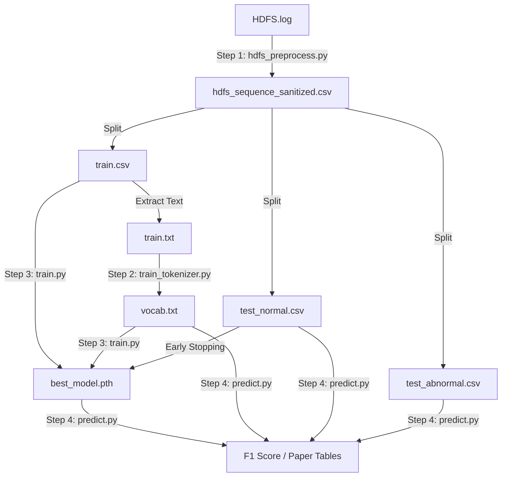

为了让你对整个实验流程的数据流向（Data Pipeline）一目了然，我将这些文件按**生成阶段**和**功能用途**进行了分类标注。

这些文件构成了你论文实验的完整证据链。

### 1. 核心产物 (The "Brain")
这是训练脚本最终生成的、价值最高的文件。

*   **`best_model.pth`**
    *   **来源**: `train.py` 在 Early Stopping 过程中保存的。
    *   **内容**: 包含两个关键对象：
        1.  `model_state_dict`: TinyBERT 的所有权重参数（已学会 HDFS 语法）。
        2.  `center`: 训练好的超球体中心向量（正常日志的“聚类中心”）。
    *   **用途**: **推理核心**。`predict.py` 将加载它来判断新日志离这个中心有多远。

### 2. 基础设施 (Infrastructure)
这是让 BERT 理解日志“语言”的字典。

*   **`vocab.txt`**
    *   **来源**: `train_tokenizer.py` (基于 `train.txt` 训练生成)。
    *   **内容**: 约 3000 行。每行一个 Token（如 `[BLK]`, `packet`, `##ponder`）。
    *   **用途**: **翻译官**。它负责把文本日志转换成数字 ID 序列。它是你“领域自适应（Domain Adaptation）”的核心证据。

### 3. 数据集划分 (Data Splits)
这是预处理脚本 `hdfs_preprocess.py` 将原始日志清洗并切分后的产物。

#### A. 训练组 (用于教模型什么是“正常”)
*   **`train.csv`**
    *   **内容**: 约 4855 条数据。**全都是正常样本 (Label=0)**。包含 `BlockId`, `EventSequence` 等列。
    *   **用途**: `train.py` 读取它进行训练。`train_tokenizer.py` 读取它建立词表。
*   **`train.txt`**
    *   **内容**: `train.csv` 的纯文本版本（去除了 BlockId 和表头）。
    *   **用途**: 专门喂给 `train_tokenizer.py` 的，因为 HuggingFace 的训练函数只吃纯文本。

#### B. 测试组 - 正常 (用于验证误报率 False Positive)
*   **`test_normal.csv`**
    *   **内容**: 未参与训练的正常样本。
    *   **用途**:
        1.  在 `train.py` 中作为 **验证集** (Validation Set) 指导 Early Stopping。
        2.  在 `predict.py` 中作为 **测试集**，模型**不应该**对它们报警。
*   **`test_normal.txt`**
    *   **内容**: 纯文本版本。
    *   **用途**: 兼容性备份，方便肉眼查看清洗效果。

#### C. 测试组 - 异常 (用于验证召回率 Recall)
*   **`test_abnormal.csv`**
    *   **内容**: HDFS 中所有的异常样本 (Label=1)。
    *   **用途**: **考卷**。在 `predict.py` 中使用。模型**必须**对它们报警。如果没报，就是漏报（False Negative）。
*   **`test_abnormal.txt`**
    *   **内容**: 纯文本版本。
    *   **用途**: 兼容性备份。

#### D. 总集 (Master Copy)
*   **`hdfs_sequence_sanitized.csv`**
    *   **内容**: 清洗后的全量数据。
    *   **用途**: **数据母版**。如果以后想改变 Train/Test 的切分比例（比如从 8:2 改成 5:5），不需要重新跑正则清洗，直接读这个文件重新切分即可。

---

### 数据流向图 (Data Flow)



所有文件都在它们该在的位置。现在，请开始编写最后的 **`predict.py`**，让我们看看这套系统的最终成绩单！

```angular2html
D:\develop\miniconda3\envs\berttorch\python.exe D:\OtherProjects\BERT-pytorch\HDFS\bt5_train.py 
[-] Random seed set to 42
[-] Training on cuda
[-] Loading data from ../output/hdfs/train.csv...
    Loaded 4855 samples.
[-] Splitting: Train=4370, Val=485
[-] Vocab Size: 424
[-] Initializing Hypersphere Center...
Init Center:   0%|          | 0/68 [00:00<?, ?it/s]D:\develop\miniconda3\envs\berttorch\lib\site-packages\transformers\models\bert\modeling_bert.py:435: UserWarning: 1Torch was not compiled with flash attention. (Triggered internally at C:\actions-runner\_work\pytorch\pytorch\builder\windows\pytorch\aten\src\ATen\native\transformers\cuda\sdp_utils.cpp:555.)
  attn_output = torch.nn.functional.scaled_dot_product_attention(
Init Center: 100%|██████████| 68/68 [00:24<00:00,  2.79it/s]
Epoch 1/50 [Train]:   0%|          | 0/68 [00:00<?, ?it/s][-] Center initialized. Norm: 2.2375
Epoch 1/50 [Train]: 100%|██████████| 68/68 [00:35<00:00,  1.94it/s, Loss=1.1260, MLM_Acc=49.16%]
Epoch 1: Train Loss=2.5890, Val Loss=1.0782, Train Acc=49.16%
    [*] Saving new best model...
Epoch 2/50 [Train]: 100%|██████████| 68/68 [00:35<00:00,  1.93it/s, Loss=0.7034, MLM_Acc=71.72%]
Epoch 2: Train Loss=0.9647, Val Loss=0.7875, Train Acc=71.72%
    [*] Saving new best model...
Epoch 3/50 [Train]: 100%|██████████| 68/68 [00:34<00:00,  1.99it/s, Loss=0.5328, MLM_Acc=75.20%]
Epoch 3: Train Loss=0.7751, Val Loss=0.6073, Train Acc=75.20%
    [*] Saving new best model...
Epoch 4/50 [Train]: 100%|██████████| 68/68 [00:33<00:00,  2.01it/s, Loss=0.6828, MLM_Acc=81.00%]
Epoch 4: Train Loss=0.6179, Val Loss=0.4753, Train Acc=81.00%
    [*] Saving new best model...
Epoch 5/50 [Train]: 100%|██████████| 68/68 [00:34<00:00,  1.96it/s, Loss=0.6880, MLM_Acc=83.94%]
Epoch 5: Train Loss=0.5276, Val Loss=0.4019, Train Acc=83.94%
    [*] Saving new best model...
Epoch 6/50 [Train]: 100%|██████████| 68/68 [00:34<00:00,  1.95it/s, Loss=0.3838, MLM_Acc=86.20%]
Epoch 6: Train Loss=0.4619, Val Loss=0.3694, Train Acc=86.20%
    [*] Saving new best model...
Epoch 7/50 [Train]: 100%|██████████| 68/68 [00:34<00:00,  1.96it/s, Loss=0.2537, MLM_Acc=87.86%]
Epoch 7: Train Loss=0.4126, Val Loss=0.3380, Train Acc=87.86%
    [*] Saving new best model...
Epoch 8/50 [Train]: 100%|██████████| 68/68 [00:34<00:00,  1.95it/s, Loss=0.1764, MLM_Acc=88.90%]
Epoch 8: Train Loss=0.3797, Val Loss=0.3003, Train Acc=88.90%
    [*] Saving new best model...
Epoch 9/50 [Train]: 100%|██████████| 68/68 [00:34<00:00,  1.99it/s, Loss=0.3113, MLM_Acc=89.69%]
Epoch 9: Train Loss=0.3489, Val Loss=0.2786, Train Acc=89.69%
    [*] Saving new best model...
Epoch 10/50 [Train]: 100%|██████████| 68/68 [00:35<00:00,  1.94it/s, Loss=0.2645, MLM_Acc=90.23%]
Epoch 10: Train Loss=0.3286, Val Loss=0.2453, Train Acc=90.23%
    [*] Saving new best model...
Epoch 11/50 [Train]: 100%|██████████| 68/68 [00:34<00:00,  1.98it/s, Loss=0.2825, MLM_Acc=90.40%]
Epoch 11: Train Loss=0.3230, Val Loss=0.2444, Train Acc=90.40%
    [*] Saving new best model...
Epoch 12/50 [Train]: 100%|██████████| 68/68 [00:34<00:00,  1.98it/s, Loss=0.2315, MLM_Acc=91.13%]
Epoch 12: Train Loss=0.2962, Val Loss=0.2300, Train Acc=91.13%
    [*] Saving new best model...
Epoch 13/50 [Train]: 100%|██████████| 68/68 [00:34<00:00,  1.97it/s, Loss=0.3062, MLM_Acc=91.57%]
Epoch 13: Train Loss=0.2796, Val Loss=0.2181, Train Acc=91.57%
    [*] Saving new best model...
Epoch 14/50 [Train]: 100%|██████████| 68/68 [00:34<00:00,  1.96it/s, Loss=0.1373, MLM_Acc=91.67%]
Epoch 14: Train Loss=0.2757, Val Loss=0.2149, Train Acc=91.67%
    [*] Saving new best model...
Epoch 15/50 [Train]: 100%|██████████| 68/68 [00:34<00:00,  1.99it/s, Loss=0.3140, MLM_Acc=92.09%]
Epoch 15: Train Loss=0.2635, Val Loss=0.2002, Train Acc=92.09%
    [*] Saving new best model...
Epoch 16/50 [Train]: 100%|██████████| 68/68 [00:34<00:00,  1.95it/s, Loss=0.1659, MLM_Acc=92.15%]
Epoch 16: Train Loss=0.2611, Val Loss=0.1901, Train Acc=92.15%
    [*] Saving new best model...
Epoch 17/50 [Train]: 100%|██████████| 68/68 [00:34<00:00,  1.95it/s, Loss=0.1486, MLM_Acc=92.42%]
Epoch 17: Train Loss=0.2499, Val Loss=0.1871, Train Acc=92.42%
    [*] Saving new best model...
Epoch 18/50 [Train]: 100%|██████████| 68/68 [00:34<00:00,  1.95it/s, Loss=0.2196, MLM_Acc=92.57%]
Epoch 18: Train Loss=0.2479, Val Loss=0.1932, Train Acc=92.57%
    [!] Patience: 1/3
Epoch 19/50 [Train]: 100%|██████████| 68/68 [00:36<00:00,  1.87it/s, Loss=0.2342, MLM_Acc=92.90%]
Epoch 20/50 [Train]:   0%|          | 0/68 [00:00<?, ?it/s]Epoch 19: Train Loss=0.2366, Val Loss=0.1897, Train Acc=92.90%
    [!] Patience: 2/3
Epoch 20/50 [Train]: 100%|██████████| 68/68 [00:34<00:00,  1.98it/s, Loss=0.1470, MLM_Acc=93.06%]
Epoch 20: Train Loss=0.2285, Val Loss=0.1731, Train Acc=93.06%
    [*] Saving new best model...
Epoch 21/50 [Train]: 100%|██████████| 68/68 [00:34<00:00,  1.98it/s, Loss=0.2444, MLM_Acc=93.32%]
Epoch 21: Train Loss=0.2192, Val Loss=0.1674, Train Acc=93.32%
    [*] Saving new best model...
Epoch 22/50 [Train]: 100%|██████████| 68/68 [00:33<00:00,  2.01it/s, Loss=0.1496, MLM_Acc=93.59%]
Epoch 22: Train Loss=0.2108, Val Loss=0.1635, Train Acc=93.59%
    [*] Saving new best model...
Epoch 23/50 [Train]: 100%|██████████| 68/68 [00:35<00:00,  1.92it/s, Loss=0.2987, MLM_Acc=93.67%]
Epoch 23: Train Loss=0.2049, Val Loss=0.1507, Train Acc=93.67%
    [*] Saving new best model...
Epoch 24/50 [Train]: 100%|██████████| 68/68 [00:34<00:00,  1.96it/s, Loss=0.1736, MLM_Acc=93.94%]
Epoch 24: Train Loss=0.1975, Val Loss=0.1480, Train Acc=93.94%
    [*] Saving new best model...
Epoch 25/50 [Train]: 100%|██████████| 68/68 [00:33<00:00,  2.01it/s, Loss=0.1723, MLM_Acc=94.04%]
Epoch 26/50 [Train]:   0%|          | 0/68 [00:00<?, ?it/s]Epoch 25: Train Loss=0.1913, Val Loss=0.1485, Train Acc=94.04%
    [!] Patience: 1/3
Epoch 26/50 [Train]: 100%|██████████| 68/68 [00:34<00:00,  1.95it/s, Loss=0.1722, MLM_Acc=94.17%]
Epoch 26: Train Loss=0.1872, Val Loss=0.1459, Train Acc=94.17%
    [*] Saving new best model...
Epoch 27/50 [Train]: 100%|██████████| 68/68 [00:34<00:00,  1.96it/s, Loss=0.1960, MLM_Acc=94.49%]
Epoch 27: Train Loss=0.1757, Val Loss=0.1277, Train Acc=94.49%
    [*] Saving new best model...
Epoch 28/50 [Train]: 100%|██████████| 68/68 [00:34<00:00,  1.95it/s, Loss=0.2537, MLM_Acc=94.58%]
Epoch 29/50 [Train]:   0%|          | 0/68 [00:00<?, ?it/s]Epoch 28: Train Loss=0.1720, Val Loss=0.1312, Train Acc=94.58%
    [!] Patience: 1/3
Epoch 29/50 [Train]: 100%|██████████| 68/68 [00:33<00:00,  2.04it/s, Loss=0.2495, MLM_Acc=94.81%]
Epoch 29: Train Loss=0.1629, Val Loss=0.1175, Train Acc=94.81%
    [*] Saving new best model...
Epoch 30/50 [Train]: 100%|██████████| 68/68 [00:33<00:00,  2.04it/s, Loss=0.1082, MLM_Acc=94.80%]
Epoch 30: Train Loss=0.1615, Val Loss=0.1226, Train Acc=94.80%
    [!] Patience: 1/3
Epoch 31/50 [Train]: 100%|██████████| 68/68 [00:33<00:00,  2.04it/s, Loss=0.1376, MLM_Acc=95.25%]
Epoch 31: Train Loss=0.1468, Val Loss=0.1082, Train Acc=95.25%
    [*] Saving new best model...
Epoch 32/50 [Train]: 100%|██████████| 68/68 [00:33<00:00,  2.04it/s, Loss=0.1265, MLM_Acc=95.33%]
Epoch 32: Train Loss=0.1425, Val Loss=0.0954, Train Acc=95.33%
    [*] Saving new best model...
Epoch 33/50 [Train]: 100%|██████████| 68/68 [00:33<00:00,  2.04it/s, Loss=0.0808, MLM_Acc=95.51%]
Epoch 33: Train Loss=0.1354, Val Loss=0.0906, Train Acc=95.51%
    [*] Saving new best model...
Epoch 34/50 [Train]: 100%|██████████| 68/68 [00:33<00:00,  2.04it/s, Loss=0.1249, MLM_Acc=95.72%]
Epoch 34: Train Loss=0.1272, Val Loss=0.0861, Train Acc=95.72%
    [*] Saving new best model...
Epoch 35/50 [Train]: 100%|██████████| 68/68 [00:33<00:00,  2.01it/s, Loss=0.1402, MLM_Acc=96.01%]
Epoch 35: Train Loss=0.1177, Val Loss=0.0716, Train Acc=96.01%
    [*] Saving new best model...
Epoch 36/50 [Train]: 100%|██████████| 68/68 [00:33<00:00,  2.01it/s, Loss=0.1668, MLM_Acc=96.13%]
Epoch 36: Train Loss=0.1143, Val Loss=0.0690, Train Acc=96.13%
    [*] Saving new best model...
Epoch 37/50 [Train]: 100%|██████████| 68/68 [00:33<00:00,  2.02it/s, Loss=0.1669, MLM_Acc=96.40%]
Epoch 37: Train Loss=0.1058, Val Loss=0.0596, Train Acc=96.40%
    [*] Saving new best model...
Epoch 38/50 [Train]: 100%|██████████| 68/68 [00:33<00:00,  2.02it/s, Loss=0.0651, MLM_Acc=96.74%]
Epoch 38: Train Loss=0.0955, Val Loss=0.0515, Train Acc=96.74%
    [*] Saving new best model...
Epoch 39/50 [Train]: 100%|██████████| 68/68 [00:33<00:00,  2.01it/s, Loss=0.1471, MLM_Acc=96.87%]
Epoch 39: Train Loss=0.0926, Val Loss=0.0454, Train Acc=96.87%
    [*] Saving new best model...
Epoch 40/50 [Train]: 100%|██████████| 68/68 [00:33<00:00,  2.02it/s, Loss=0.0818, MLM_Acc=97.13%]
Epoch 40: Train Loss=0.0843, Val Loss=0.0448, Train Acc=97.13%
    [*] Saving new best model...
Epoch 41/50 [Train]: 100%|██████████| 68/68 [00:34<00:00,  1.99it/s, Loss=0.0388, MLM_Acc=97.37%]
Epoch 41: Train Loss=0.0778, Val Loss=0.0364, Train Acc=97.37%
    [*] Saving new best model...
Epoch 42/50 [Train]: 100%|██████████| 68/68 [00:34<00:00,  2.00it/s, Loss=0.0428, MLM_Acc=97.64%]
Epoch 42: Train Loss=0.0713, Val Loss=0.0316, Train Acc=97.64%
    [*] Saving new best model...
Epoch 43/50 [Train]: 100%|██████████| 68/68 [00:33<00:00,  2.04it/s, Loss=0.0351, MLM_Acc=97.85%]
Epoch 43: Train Loss=0.0654, Val Loss=0.0267, Train Acc=97.85%
    [*] Saving new best model...
Epoch 44/50 [Train]: 100%|██████████| 68/68 [00:33<00:00,  2.04it/s, Loss=0.0741, MLM_Acc=98.08%]
Epoch 44: Train Loss=0.0585, Val Loss=0.0265, Train Acc=98.08%
    [*] Saving new best model...
Epoch 45/50 [Train]: 100%|██████████| 68/68 [00:33<00:00,  2.04it/s, Loss=0.0512, MLM_Acc=98.15%]
Epoch 45: Train Loss=0.0559, Val Loss=0.0219, Train Acc=98.15%
    [*] Saving new best model...
Epoch 46/50 [Train]: 100%|██████████| 68/68 [00:33<00:00,  2.04it/s, Loss=0.0486, MLM_Acc=98.33%]
Epoch 46: Train Loss=0.0513, Val Loss=0.0213, Train Acc=98.33%
    [*] Saving new best model...
Epoch 47/50 [Train]: 100%|██████████| 68/68 [00:33<00:00,  2.04it/s, Loss=0.0462, MLM_Acc=98.44%]
Epoch 47: Train Loss=0.0481, Val Loss=0.0171, Train Acc=98.44%
    [*] Saving new best model...
Epoch 48/50 [Train]: 100%|██████████| 68/68 [00:33<00:00,  2.04it/s, Loss=0.0258, MLM_Acc=98.62%]
Epoch 48: Train Loss=0.0432, Val Loss=0.0141, Train Acc=98.62%
    [*] Saving new best model...
Epoch 49/50 [Train]: 100%|██████████| 68/68 [00:33<00:00,  2.04it/s, Loss=0.0386, MLM_Acc=98.67%]
Epoch 49: Train Loss=0.0406, Val Loss=0.0134, Train Acc=98.67%
    [*] Saving new best model...
Epoch 50/50 [Train]: 100%|██████████| 68/68 [00:33<00:00,  2.04it/s, Loss=0.0388, MLM_Acc=98.88%]
Epoch 50: Train Loss=0.0356, Val Loss=0.0116, Train Acc=98.88%
    [*] Saving new best model...
```
```angular2html
self.test_ratio = 0.1
D:\develop\miniconda3\envs\berttorch\python.exe D:\OtherProjects\BERT-pytorch\HDFS\bp6_predict.py
[-] Loaded Tokenizer. Real Vocab Size: 424
[-] Loading model from ../output/hdfs/best_model.pth...
[-] Hypersphere Center loaded. Norm: 2.2375
[-] Loading data from ../output/hdfs/test_normal.csv...
[-] Loading data from ../output/hdfs/test_abnormal.csv...
Extracting Features:   0%|          | 0/109 [00:00<?, ?it/s][-] Extracting features (K=10)...
D:\develop\miniconda3\envs\berttorch\lib\site-packages\transformers\models\bert\modeling_bert.py:435: UserWarning: 1Torch was not compiled with flash attention. (Triggered internally at C:\actions-runner_work\pytorch\pytorch\builder\windows\pytorch\aten\src\ATen\native\transformers\cuda\sdp_utils.cpp:555.)
attn_output = torch.nn.functional.scaled_dot_product_attention(
Extracting Features: 100%|██████████| 109/109 [01:30<00:00,  1.21it/s]
Extracting Features: 100%|██████████| 4/4 [00:25<00:00,  6.47s/it]
============================================================
HYBRID SEARCH (Alpha * Dist + (1-Alpha) * TopK)
Alpha  | Prec     | Rec      | F1       | AUC
0.0    | 0.9533   | 0.8241   | 0.8840   | 0.9139
0.1    | 0.9535   | 0.8289   | 0.8868   | 0.9179
0.2    | 0.9541   | 0.8271   | 0.8861   | 0.9178
0.3    | 0.9364   | 0.8217   | 0.8753   | 0.9177
0.4    | 0.8955   | 0.8200   | 0.8561   | 0.9175
0.5    | 0.9232   | 0.7576   | 0.8322   | 0.9163
0.6    | 0.6656   | 0.6090   | 0.6361   | 0.9089
0.7    | 0.7990   | 0.2763   | 0.4106   | 0.8895
0.8    | 0.8012   | 0.2442   | 0.3743   | 0.8760
0.9    | 0.7952   | 0.2377   | 0.3660   | 0.8566
1.0    | 0.7162   | 0.2175   | 0.3336   | 0.7658
🏆 BEST RESULT:
Alpha    : 0.1 (0=TopK, 1=Dist)
F1 Score : 0.8868
AUC Score: 0.9179
结论: 混合策略有效！
Process finished with exit code 0
```
```angular2html
self.test_ratio = 0.5
D:\develop\miniconda3\envs\berttorch\python.exe D:\OtherProjects\BERT-pytorch\HDFS\bp6_predict.py 
[-] Loaded Tokenizer. Real Vocab Size: 424
[-] Loading model from ../output/hdfs/best_model.pth...
[-] Hypersphere Center loaded. Norm: 2.2375
[-] Loading data from ../output/hdfs/test_normal.csv...
[-] Loading data from ../output/hdfs/test_abnormal.csv...
Extracting Features:   0%|          | 0/541 [00:00<?, ?it/s][-] Extracting features (K=10)...
D:\develop\miniconda3\envs\berttorch\lib\site-packages\transformers\models\bert\modeling_bert.py:435: UserWarning: 1Torch was not compiled with flash attention. (Triggered internally at C:\actions-runner\_work\pytorch\pytorch\builder\windows\pytorch\aten\src\ATen\native\transformers\cuda\sdp_utils.cpp:555.)
  attn_output = torch.nn.functional.scaled_dot_product_attention(
Extracting Features: 100%|██████████| 541/541 [05:34<00:00,  1.62it/s]
Extracting Features: 100%|██████████| 17/17 [00:33<00:00,  1.94s/it]

============================================================
HYBRID SEARCH (Alpha * Dist + (1-Alpha) * TopK)
============================================================
Alpha  | Prec     | Rec      | F1       | AUC     
--------------------------------------------------
0.0    | 0.9419   | 0.8147   | 0.8737   | 0.9087
0.1    | 0.9421   | 0.8192   | 0.8764   | 0.9132
0.2    | 0.9411   | 0.8179   | 0.8752   | 0.9132
0.3    | 0.9163   | 0.8170   | 0.8638   | 0.9131
0.4    | 0.8899   | 0.8067   | 0.8463   | 0.9129
0.5    | 0.9022   | 0.7636   | 0.8271   | 0.9118
0.6    | 0.7098   | 0.6073   | 0.6546   | 0.9058
0.7    | 0.6619   | 0.3101   | 0.4224   | 0.8865
0.8    | 0.7697   | 0.2465   | 0.3734   | 0.8729
0.9    | 0.7474   | 0.2365   | 0.3593   | 0.8532
1.0    | 0.6960   | 0.2172   | 0.3311   | 0.7623
============================================================
🏆 BEST RESULT:
   Alpha    : 0.1 (0=TopK, 1=Dist)
   F1 Score : 0.8764
   AUC Score: 0.9132
>> 结论: Top-K 仍然主导。

Process finished with exit code 0
```
```angular2html
self.test_ratio = 1
D:\develop\miniconda3\envs\berttorch\python.exe D:\OtherProjects\BERT-pytorch\HDFS\bp6_predict.py 
[-] Loaded Tokenizer. Real Vocab Size: 424
[-] Loading model from ../output/hdfs/best_model.pth...
[-] Hypersphere Center loaded. Norm: 2.2375
[-] Loading data from ../output/hdfs/test_normal.csv...
[-] Loading data from ../output/hdfs/test_abnormal.csv...
[-] Extracting features (K=10)...
Extracting Features:   0%|          | 0/1081 [00:00<?, ?it/s]D:\develop\miniconda3\envs\berttorch\lib\site-packages\transformers\models\bert\modeling_bert.py:435: UserWarning: 1Torch was not compiled with flash attention. (Triggered internally at C:\actions-runner\_work\pytorch\pytorch\builder\windows\pytorch\aten\src\ATen\native\transformers\cuda\sdp_utils.cpp:555.)
  attn_output = torch.nn.functional.scaled_dot_product_attention(
Extracting Features: 100%|██████████| 1081/1081 [10:42<00:00,  1.68it/s]
Extracting Features: 100%|██████████| 33/33 [00:42<00:00,  1.28s/it]

============================================================
HYBRID SEARCH (Alpha * Dist + (1-Alpha) * TopK)
============================================================
Alpha  | Prec     | Rec      | F1       | AUC     
--------------------------------------------------
0.0    | 0.9441   | 0.8179   | 0.8765   | 0.9104
0.1    | 0.9443   | 0.8224   | 0.8792   | 0.9159
0.2    | 0.9440   | 0.8214   | 0.8784   | 0.9159
0.3    | 0.9181   | 0.8207   | 0.8667   | 0.9158
0.4    | 0.8931   | 0.8093   | 0.8491   | 0.9157
0.5    | 0.9050   | 0.7669   | 0.8303   | 0.9146
0.6    | 0.7142   | 0.6127   | 0.6595   | 0.9085
0.7    | 0.6649   | 0.3093   | 0.4222   | 0.8892
0.8    | 0.7652   | 0.2461   | 0.3724   | 0.8753
0.9    | 0.7469   | 0.2345   | 0.3570   | 0.8553
1.0    | 0.6932   | 0.2158   | 0.3291   | 0.7630
============================================================
🏆 BEST RESULT:
   Alpha    : 0.1 (0=TopK, 1=Dist)
   F1 Score : 0.8792
   AUC Score: 0.9159
>> 结论: Top-K 仍然主导。

Process finished with exit code 0
```
# 2026.01.28
```angular2html
D:\develop\miniconda3\envs\berttorch\python.exe D:\OtherProjects\BERT-pytorch\HDFS\bp6_predict.py 
[-] Loading model with vocab_size=424...
[-] Center loaded. Norm: 2.2375
[-] Loading data from ../output/hdfs/test_normal.csv...
[-] Loading data from ../output/hdfs/test_abnormal.csv...
[-] Extracting features (K=[5, 10, 15, 20])...
Extracting:   0%|          | 0/109 [00:00<?, ?it/s]D:\develop\miniconda3\envs\berttorch\lib\site-packages\transformers\models\bert\modeling_bert.py:435: UserWarning: 1Torch was not compiled with flash attention. (Triggered internally at C:\actions-runner\_work\pytorch\pytorch\builder\windows\pytorch\aten\src\ATen\native\transformers\cuda\sdp_utils.cpp:555.)
  attn_output = torch.nn.functional.scaled_dot_product_attention(
Extracting: 100%|██████████| 109/109 [04:55<00:00,  2.71s/it]
Extracting: 100%|██████████| 4/4 [00:08<00:00,  2.03s/it]

============================================================
GRID SEARCH: Z-Score(Dist) + Z-Score(TopK)
============================================================
K   | Alpha | Prec    | Rec     | F1      | AUC    
--------------------------------------------------
10  | 0.0   | 0.9469  | 0.8259  | 0.8823  | 0.9139
10  | 0.1   | 0.9553  | 0.8259  | 0.8859  | 0.9278
10  | 0.2   | 0.9496  | 0.8283  | 0.8848  | 0.9277
10  | 0.3   | 0.9302  | 0.8235  | 0.8736  | 0.9276
10  | 0.4   | 0.9261  | 0.7891  | 0.8521  | 0.9275
15  | 0.0   | 0.9272  | 0.8170  | 0.8686  | 0.9144
15  | 0.1   | 0.9548  | 0.8158  | 0.8798  | 0.9279
15  | 0.2   | 0.9559  | 0.8247  | 0.8855  | 0.9278
15  | 0.3   | 0.9554  | 0.8277  | 0.8870  | 0.9277
15  | 0.4   | 0.9407  | 0.8194  | 0.8758  | 0.9276
20  | 0.0   | 0.9476  | 0.7843  | 0.8583  | 0.9109
20  | 0.1   | 0.9428  | 0.8229  | 0.8788  | 0.9279
20  | 0.2   | 0.9542  | 0.8170  | 0.8803  | 0.9278
20  | 0.3   | 0.9513  | 0.8241  | 0.8832  | 0.9278
20  | 0.4   | 0.9500  | 0.8241  | 0.8826  | 0.9276
20  | 0.5   | 0.9146  | 0.7956  | 0.8510  | 0.9273
============================================================
🏆 GLOBAL BEST:
   K        : 15
   Alpha    : 0.3 (0=TopK, 1=Dist)
   F1 Score : 0.8870
   AUC Score: 0.9277

Process finished with exit code 0
```
```angular2html
prob < 0.45
D:\develop\miniconda3\envs\berttorch\python.exe D:\OtherProjects\BERT-pytorch\HDFS\bt5_train.py 
[-] Random seed set to 42
[-] Training on cuda
[-] Loading data from ../output/hdfs/train.csv...
    Loaded 4855 samples.
[-] Splitting: Train=4370, Val=485
[-] Vocab Size: 424
[-] Initializing Hypersphere Center...
Init Center:   0%|          | 0/68 [00:00<?, ?it/s]D:\develop\miniconda3\envs\berttorch\lib\site-packages\transformers\models\bert\modeling_bert.py:435: UserWarning: 1Torch was not compiled with flash attention. (Triggered internally at C:\actions-runner\_work\pytorch\pytorch\builder\windows\pytorch\aten\src\ATen\native\transformers\cuda\sdp_utils.cpp:555.)
  attn_output = torch.nn.functional.scaled_dot_product_attention(
Init Center: 100%|██████████| 68/68 [00:24<00:00,  2.78it/s]
[-] Center initialized. Norm: 2.2375
Epoch 1/50 [Train]: 100%|██████████| 68/68 [00:34<00:00,  2.00it/s, Loss=1.1362, MLM_Acc=49.70%]
Epoch 1: Train Loss=2.5559, Val Loss=1.0614, Train Acc=49.70%
    [*] Saving new best model...
Epoch 2/50 [Train]: 100%|██████████| 68/68 [00:35<00:00,  1.94it/s, Loss=0.6853, MLM_Acc=72.14%]
Epoch 2: Train Loss=0.9336, Val Loss=0.7514, Train Acc=72.14%
    [*] Saving new best model...
Epoch 3/50 [Train]: 100%|██████████| 68/68 [00:35<00:00,  1.90it/s, Loss=0.4827, MLM_Acc=76.84%]
Epoch 3: Train Loss=0.7311, Val Loss=0.5772, Train Acc=76.84%
    [*] Saving new best model...
Epoch 4/50 [Train]: 100%|██████████| 68/68 [00:35<00:00,  1.91it/s, Loss=0.6504, MLM_Acc=81.80%]
Epoch 4: Train Loss=0.5868, Val Loss=0.4521, Train Acc=81.80%
    [*] Saving new best model...
Epoch 5/50 [Train]: 100%|██████████| 68/68 [00:34<00:00,  1.98it/s, Loss=0.6707, MLM_Acc=85.47%]
Epoch 5: Train Loss=0.4832, Val Loss=0.3736, Train Acc=85.47%
    [*] Saving new best model...
Epoch 6/50 [Train]: 100%|██████████| 68/68 [00:34<00:00,  1.97it/s, Loss=0.3444, MLM_Acc=87.27%]
Epoch 6: Train Loss=0.4256, Val Loss=0.3230, Train Acc=87.27%
    [*] Saving new best model...
Epoch 7/50 [Train]: 100%|██████████| 68/68 [00:35<00:00,  1.92it/s, Loss=0.2394, MLM_Acc=88.63%]
Epoch 7: Train Loss=0.3848, Val Loss=0.2956, Train Acc=88.63%
    [*] Saving new best model...
Epoch 8/50 [Train]: 100%|██████████| 68/68 [00:36<00:00,  1.87it/s, Loss=0.1355, MLM_Acc=90.00%]
Epoch 8: Train Loss=0.3401, Val Loss=0.2641, Train Acc=90.00%
    [*] Saving new best model...
Epoch 9/50 [Train]: 100%|██████████| 68/68 [00:34<00:00,  1.99it/s, Loss=0.2735, MLM_Acc=90.61%]
Epoch 9: Train Loss=0.3146, Val Loss=0.2504, Train Acc=90.61%
    [*] Saving new best model...
Epoch 10/50 [Train]: 100%|██████████| 68/68 [00:34<00:00,  1.99it/s, Loss=0.1790, MLM_Acc=91.23%]
Epoch 10: Train Loss=0.2929, Val Loss=0.2199, Train Acc=91.23%
    [*] Saving new best model...
Epoch 11/50 [Train]: 100%|██████████| 68/68 [00:34<00:00,  1.95it/s, Loss=0.2374, MLM_Acc=91.67%]
Epoch 11: Train Loss=0.2789, Val Loss=0.2256, Train Acc=91.67%
    [!] Patience: 1/3
Epoch 12/50 [Train]: 100%|██████████| 68/68 [00:34<00:00,  1.97it/s, Loss=0.2180, MLM_Acc=92.08%]
Epoch 12: Train Loss=0.2667, Val Loss=0.2072, Train Acc=92.08%
    [*] Saving new best model...
Epoch 13/50 [Train]: 100%|██████████| 68/68 [00:34<00:00,  1.98it/s, Loss=0.3121, MLM_Acc=92.34%]
Epoch 13: Train Loss=0.2590, Val Loss=0.1994, Train Acc=92.34%
    [*] Saving new best model...
Epoch 14/50 [Train]: 100%|██████████| 68/68 [00:34<00:00,  1.97it/s, Loss=0.1161, MLM_Acc=92.73%]
Epoch 14: Train Loss=0.2443, Val Loss=0.1931, Train Acc=92.73%
    [*] Saving new best model...
Epoch 15/50 [Train]: 100%|██████████| 68/68 [00:34<00:00,  1.98it/s, Loss=0.2879, MLM_Acc=92.99%]
Epoch 15: Train Loss=0.2356, Val Loss=0.1752, Train Acc=92.99%
    [*] Saving new best model...
Epoch 16/50 [Train]: 100%|██████████| 68/68 [00:34<00:00,  1.97it/s, Loss=0.1534, MLM_Acc=93.08%]
Epoch 16: Train Loss=0.2312, Val Loss=0.1844, Train Acc=93.08%
    [!] Patience: 1/3
Epoch 17/50 [Train]: 100%|██████████| 68/68 [00:34<00:00,  1.97it/s, Loss=0.1197, MLM_Acc=93.31%]
Epoch 17: Train Loss=0.2218, Val Loss=0.1715, Train Acc=93.31%
    [*] Saving new best model...
Epoch 18/50 [Train]: 100%|██████████| 68/68 [00:34<00:00,  1.97it/s, Loss=0.2062, MLM_Acc=93.56%]
Epoch 18: Train Loss=0.2127, Val Loss=0.1716, Train Acc=93.56%
    [!] Patience: 1/3
Epoch 19/50 [Train]: 100%|██████████| 68/68 [00:34<00:00,  1.98it/s, Loss=0.2238, MLM_Acc=93.74%]
Epoch 19: Train Loss=0.2050, Val Loss=0.1620, Train Acc=93.74%
    [*] Saving new best model...
Epoch 20/50 [Train]: 100%|██████████| 68/68 [00:35<00:00,  1.92it/s, Loss=0.1123, MLM_Acc=94.01%]
Epoch 20: Train Loss=0.1929, Val Loss=0.1489, Train Acc=94.01%
    [*] Saving new best model...
Epoch 21/50 [Train]: 100%|██████████| 68/68 [00:37<00:00,  1.82it/s, Loss=0.2387, MLM_Acc=94.25%]
Epoch 21: Train Loss=0.1849, Val Loss=0.1465, Train Acc=94.25%
    [*] Saving new best model...
Epoch 22/50 [Train]: 100%|██████████| 68/68 [00:34<00:00,  1.97it/s, Loss=0.1461, MLM_Acc=94.31%]
Epoch 22: Train Loss=0.1818, Val Loss=0.1298, Train Acc=94.31%
    [*] Saving new best model...
Epoch 23/50 [Train]: 100%|██████████| 68/68 [00:34<00:00,  1.99it/s, Loss=0.2238, MLM_Acc=94.70%]
Epoch 23: Train Loss=0.1676, Val Loss=0.1204, Train Acc=94.70%
    [*] Saving new best model...
Epoch 24/50 [Train]: 100%|██████████| 68/68 [00:34<00:00,  1.94it/s, Loss=0.1516, MLM_Acc=94.86%]
Epoch 24: Train Loss=0.1625, Val Loss=0.1179, Train Acc=94.86%
    [*] Saving new best model...
Epoch 25/50 [Train]: 100%|██████████| 68/68 [00:35<00:00,  1.91it/s, Loss=0.1432, MLM_Acc=94.97%]
Epoch 25: Train Loss=0.1565, Val Loss=0.1054, Train Acc=94.97%
    [*] Saving new best model...
Epoch 26/50 [Train]: 100%|██████████| 68/68 [00:34<00:00,  2.00it/s, Loss=0.1613, MLM_Acc=95.24%]
Epoch 26: Train Loss=0.1479, Val Loss=0.1029, Train Acc=95.24%
    [*] Saving new best model...
Epoch 27/50 [Train]: 100%|██████████| 68/68 [00:34<00:00,  1.94it/s, Loss=0.1452, MLM_Acc=95.29%]
Epoch 27: Train Loss=0.1451, Val Loss=0.0909, Train Acc=95.29%
    [*] Saving new best model...
Epoch 28/50 [Train]: 100%|██████████| 68/68 [00:38<00:00,  1.77it/s, Loss=0.2079, MLM_Acc=95.64%]
Epoch 28: Train Loss=0.1317, Val Loss=0.0955, Train Acc=95.64%
    [!] Patience: 1/3
Epoch 29/50 [Train]: 100%|██████████| 68/68 [00:38<00:00,  1.76it/s, Loss=0.2072, MLM_Acc=95.75%]
Epoch 29: Train Loss=0.1286, Val Loss=0.0807, Train Acc=95.75%
    [*] Saving new best model...
Epoch 30/50 [Train]: 100%|██████████| 68/68 [00:37<00:00,  1.83it/s, Loss=0.0753, MLM_Acc=96.06%]
Epoch 30: Train Loss=0.1179, Val Loss=0.0805, Train Acc=96.06%
    [*] Saving new best model...
Epoch 31/50 [Train]: 100%|██████████| 68/68 [00:37<00:00,  1.81it/s, Loss=0.1072, MLM_Acc=96.19%]
Epoch 31: Train Loss=0.1146, Val Loss=0.0743, Train Acc=96.19%
    [*] Saving new best model...
Epoch 32/50 [Train]: 100%|██████████| 68/68 [00:35<00:00,  1.92it/s, Loss=0.0788, MLM_Acc=96.40%]
Epoch 32: Train Loss=0.1075, Val Loss=0.0678, Train Acc=96.40%
    [*] Saving new best model...
Epoch 33/50 [Train]: 100%|██████████| 68/68 [00:34<00:00,  1.99it/s, Loss=0.0564, MLM_Acc=96.50%]
Epoch 33: Train Loss=0.1038, Val Loss=0.0668, Train Acc=96.50%
    [*] Saving new best model...
Epoch 34/50 [Train]: 100%|██████████| 68/68 [00:33<00:00,  2.01it/s, Loss=0.1120, MLM_Acc=96.75%]
Epoch 34: Train Loss=0.0969, Val Loss=0.0555, Train Acc=96.75%
    [*] Saving new best model...
Epoch 35/50 [Train]: 100%|██████████| 68/68 [00:33<00:00,  2.00it/s, Loss=0.1301, MLM_Acc=96.86%]
Epoch 35: Train Loss=0.0928, Val Loss=0.0542, Train Acc=96.86%
    [*] Saving new best model...
Epoch 36/50 [Train]: 100%|██████████| 68/68 [00:35<00:00,  1.93it/s, Loss=0.1535, MLM_Acc=97.05%]
Epoch 36: Train Loss=0.0877, Val Loss=0.0462, Train Acc=97.05%
    [*] Saving new best model...
Epoch 37/50 [Train]: 100%|██████████| 68/68 [00:35<00:00,  1.91it/s, Loss=0.1145, MLM_Acc=97.24%]
Epoch 38/50 [Train]:   0%|          | 0/68 [00:00<?, ?it/s]Epoch 37: Train Loss=0.0826, Val Loss=0.0470, Train Acc=97.24%
    [!] Patience: 1/3
Epoch 38/50 [Train]: 100%|██████████| 68/68 [00:35<00:00,  1.92it/s, Loss=0.0346, MLM_Acc=97.34%]
Epoch 38: Train Loss=0.0801, Val Loss=0.0429, Train Acc=97.34%
    [*] Saving new best model...
Epoch 39/50 [Train]: 100%|██████████| 68/68 [00:34<00:00,  1.99it/s, Loss=0.0959, MLM_Acc=97.54%]
Epoch 39: Train Loss=0.0727, Val Loss=0.0365, Train Acc=97.54%
    [*] Saving new best model...
Epoch 40/50 [Train]: 100%|██████████| 68/68 [00:33<00:00,  2.02it/s, Loss=0.0512, MLM_Acc=97.63%]
Epoch 41/50 [Train]:   0%|          | 0/68 [00:00<?, ?it/s]Epoch 40: Train Loss=0.0708, Val Loss=0.0379, Train Acc=97.63%
    [!] Patience: 1/3
Epoch 41/50 [Train]: 100%|██████████| 68/68 [00:33<00:00,  2.01it/s, Loss=0.0272, MLM_Acc=97.82%]
Epoch 41: Train Loss=0.0657, Val Loss=0.0318, Train Acc=97.82%
    [*] Saving new best model...
Epoch 42/50 [Train]: 100%|██████████| 68/68 [00:34<00:00,  1.96it/s, Loss=0.0458, MLM_Acc=97.90%]
Epoch 42: Train Loss=0.0635, Val Loss=0.0335, Train Acc=97.90%
    [!] Patience: 1/3
Epoch 43/50 [Train]: 100%|██████████| 68/68 [00:34<00:00,  2.00it/s, Loss=0.0362, MLM_Acc=98.01%]
Epoch 43: Train Loss=0.0609, Val Loss=0.0289, Train Acc=98.01%
    [*] Saving new best model...
Epoch 44/50 [Train]: 100%|██████████| 68/68 [00:33<00:00,  2.00it/s, Loss=0.0926, MLM_Acc=98.11%]
Epoch 44: Train Loss=0.0582, Val Loss=0.0874, Train Acc=98.11%
    [!] Patience: 1/3
Epoch 45/50 [Train]: 100%|██████████| 68/68 [00:34<00:00,  1.97it/s, Loss=0.0586, MLM_Acc=97.40%]
Epoch 46/50 [Train]:   0%|          | 0/68 [00:00<?, ?it/s]Epoch 45: Train Loss=0.0816, Val Loss=0.0291, Train Acc=97.40%
    [!] Patience: 2/3
Epoch 46/50 [Train]: 100%|██████████| 68/68 [00:34<00:00,  1.97it/s, Loss=0.0594, MLM_Acc=98.22%]
Epoch 46: Train Loss=0.0557, Val Loss=0.0241, Train Acc=98.22%
    [*] Saving new best model...
Epoch 47/50 [Train]: 100%|██████████| 68/68 [00:34<00:00,  2.00it/s, Loss=0.0557, MLM_Acc=98.44%]
Epoch 47: Train Loss=0.0500, Val Loss=0.0200, Train Acc=98.44%
    [*] Saving new best model...
Epoch 48/50 [Train]: 100%|██████████| 68/68 [00:34<00:00,  2.00it/s, Loss=0.0320, MLM_Acc=98.58%]
Epoch 48: Train Loss=0.0456, Val Loss=0.0175, Train Acc=98.58%
    [*] Saving new best model...
Epoch 49/50 [Train]: 100%|██████████| 68/68 [00:33<00:00,  2.00it/s, Loss=0.0560, MLM_Acc=98.69%]
Epoch 49: Train Loss=0.0431, Val Loss=0.0173, Train Acc=98.69%
    [*] Saving new best model...
Epoch 50/50 [Train]: 100%|██████████| 68/68 [00:33<00:00,  2.02it/s, Loss=0.0297, MLM_Acc=98.80%]
Epoch 50: Train Loss=0.0400, Val Loss=0.0135, Train Acc=98.80%
    [*] Saving new best model...

Process finished with exit code 0
```
```angular2html
D:\develop\miniconda3\envs\berttorch\python.exe D:\OtherProjects\BERT-pytorch\HDFS\bp6_predict.py 
[-] Loading model with vocab_size=424...
[-] Center loaded. Norm: 2.2375
[-] Loading data from ../output/hdfs/test_normal.csv...
[-] Loading data from ../output/hdfs/test_abnormal.csv...
[-] Extracting features (K=[5, 10, 15, 20])...
Extracting:   0%|          | 0/109 [00:00<?, ?it/s]D:\develop\miniconda3\envs\berttorch\lib\site-packages\transformers\models\bert\modeling_bert.py:435: UserWarning: 1Torch was not compiled with flash attention. (Triggered internally at C:\actions-runner\_work\pytorch\pytorch\builder\windows\pytorch\aten\src\ATen\native\transformers\cuda\sdp_utils.cpp:555.)
  attn_output = torch.nn.functional.scaled_dot_product_attention(
Extracting: 100%|██████████| 109/109 [04:53<00:00,  2.69s/it]
Extracting: 100%|██████████| 4/4 [00:08<00:00,  2.07s/it]

============================================================
GRID SEARCH: Z-Score(Dist) + Z-Score(TopK)
============================================================
K   | Alpha | Prec    | Rec     | F1      | AUC    
--------------------------------------------------
5   | 0.0   | 0.9152  | 0.8271  | 0.8689  | 0.9512
5   | 0.1   | 0.9149  | 0.8241  | 0.8671  | 0.8696
5   | 0.2   | 0.8966  | 0.8241  | 0.8588  | 0.8610
10  | 0.0   | 0.9374  | 0.8277  | 0.8791  | 0.9142
10  | 0.1   | 0.9320  | 0.8307  | 0.8784  | 0.8614
10  | 0.2   | 0.9294  | 0.8295  | 0.8766  | 0.8613
10  | 0.3   | 0.9292  | 0.8265  | 0.8748  | 0.8613
10  | 0.4   | 0.9199  | 0.8259  | 0.8704  | 0.8612
15  | 0.0   | 0.9511  | 0.8206  | 0.8810  | 0.9146
15  | 0.1   | 0.9450  | 0.8271  | 0.8821  | 0.8617
15  | 0.2   | 0.9482  | 0.8259  | 0.8828  | 0.8617
15  | 0.3   | 0.9432  | 0.8283  | 0.8820  | 0.8616
15  | 0.4   | 0.9386  | 0.8259  | 0.8786  | 0.8615
15  | 0.5   | 0.9064  | 0.8223  | 0.8623  | 0.8613
20  | 0.0   | 0.9474  | 0.8247  | 0.8818  | 0.9139
20  | 0.1   | 0.9464  | 0.8289  | 0.8838  | 0.8615
20  | 0.2   | 0.9514  | 0.8265  | 0.8846  | 0.8615
20  | 0.3   | 0.9477  | 0.8283  | 0.8840  | 0.8614
20  | 0.4   | 0.9462  | 0.8259  | 0.8820  | 0.8614
20  | 0.5   | 0.9437  | 0.8164  | 0.8754  | 0.8613
============================================================
🏆 GLOBAL BEST:
   K        : 20
   Alpha    : 0.2 (0=TopK, 1=Dist)
   F1 Score : 0.8846
   AUC Score: 0.8615

Process finished with exit code 0
```
```angular2html
self.w_svdd = 0.5
self.w_simcse =  0.1
D:\develop\miniconda3\envs\berttorch\python.exe D:\OtherProjects\BERT-pytorch\HDFS\bt5_train.py 
[-] Random seed set to 42
[-] Training on cuda
[-] Loading data from ../output/hdfs/train.csv...
    Loaded 4855 samples.
[-] Splitting: Train=4370, Val=485
[-] Vocab Size: 424
[-] Initializing Hypersphere Center...
Init Center:   0%|          | 0/68 [00:00<?, ?it/s]D:\develop\miniconda3\envs\berttorch\lib\site-packages\transformers\models\bert\modeling_bert.py:435: UserWarning: 1Torch was not compiled with flash attention. (Triggered internally at C:\actions-runner\_work\pytorch\pytorch\builder\windows\pytorch\aten\src\ATen\native\transformers\cuda\sdp_utils.cpp:555.)
  attn_output = torch.nn.functional.scaled_dot_product_attention(
Init Center: 100%|██████████| 68/68 [00:24<00:00,  2.79it/s]
[-] Center initialized. Norm: 2.2375
Epoch 1/50 [Train]: 100%|██████████| 68/68 [00:34<00:00,  1.96it/s, Loss=1.6684, MLM_Acc=47.75%]
Epoch 1: Train Loss=3.1054, Val Loss=1.1796, Train Acc=47.75%
    [*] Saving new best model...
Epoch 2/50 [Train]: 100%|██████████| 68/68 [00:33<00:00,  2.03it/s, Loss=1.1443, MLM_Acc=71.70%]
Epoch 2: Train Loss=1.4212, Val Loss=0.8114, Train Acc=71.70%
    [*] Saving new best model...
Epoch 3/50 [Train]: 100%|██████████| 68/68 [00:33<00:00,  2.04it/s, Loss=0.9611, MLM_Acc=73.58%]
Epoch 3: Train Loss=1.2168, Val Loss=0.6504, Train Acc=73.58%
    [*] Saving new best model...
Epoch 4/50 [Train]: 100%|██████████| 68/68 [00:33<00:00,  2.01it/s, Loss=1.1264, MLM_Acc=79.16%]
Epoch 4: Train Loss=1.0708, Val Loss=0.5104, Train Acc=79.16%
    [*] Saving new best model...
Epoch 5/50 [Train]: 100%|██████████| 68/68 [00:33<00:00,  2.02it/s, Loss=1.1474, MLM_Acc=83.07%]
Epoch 5: Train Loss=0.9621, Val Loss=0.4189, Train Acc=83.07%
    [*] Saving new best model...
Epoch 6/50 [Train]: 100%|██████████| 68/68 [00:33<00:00,  2.05it/s, Loss=0.8043, MLM_Acc=85.78%]
Epoch 6: Train Loss=0.8856, Val Loss=0.3607, Train Acc=85.78%
    [*] Saving new best model...
Epoch 7/50 [Train]: 100%|██████████| 68/68 [00:33<00:00,  2.05it/s, Loss=0.6703, MLM_Acc=87.68%]
Epoch 7: Train Loss=0.8271, Val Loss=0.3137, Train Acc=87.68%
    [*] Saving new best model...
Epoch 8/50 [Train]: 100%|██████████| 68/68 [00:33<00:00,  2.05it/s, Loss=0.5852, MLM_Acc=89.20%]
Epoch 8: Train Loss=0.7752, Val Loss=0.2866, Train Acc=89.20%
    [*] Saving new best model...
Epoch 9/50 [Train]: 100%|██████████| 68/68 [00:33<00:00,  2.03it/s, Loss=0.7059, MLM_Acc=89.96%]
Epoch 9: Train Loss=0.7467, Val Loss=0.2636, Train Acc=89.96%
    [*] Saving new best model...
Epoch 10/50 [Train]: 100%|██████████| 68/68 [00:33<00:00,  2.05it/s, Loss=0.6087, MLM_Acc=90.82%]
Epoch 10: Train Loss=0.7194, Val Loss=0.2314, Train Acc=90.82%
    [*] Saving new best model...
Epoch 11/50 [Train]: 100%|██████████| 68/68 [00:33<00:00,  2.01it/s, Loss=0.6592, MLM_Acc=91.21%]
Epoch 11: Train Loss=0.7061, Val Loss=0.2302, Train Acc=91.21%
    [*] Saving new best model...
Epoch 12/50 [Train]: 100%|██████████| 68/68 [00:35<00:00,  1.90it/s, Loss=0.6423, MLM_Acc=91.68%]
Epoch 12: Train Loss=0.6899, Val Loss=0.2205, Train Acc=91.68%
    [*] Saving new best model...
Epoch 13/50 [Train]: 100%|██████████| 68/68 [00:34<00:00,  1.98it/s, Loss=0.7386, MLM_Acc=91.93%]
Epoch 13: Train Loss=0.6828, Val Loss=0.2058, Train Acc=91.93%
    [*] Saving new best model...
Epoch 14/50 [Train]: 100%|██████████| 68/68 [00:34<00:00,  1.98it/s, Loss=0.5368, MLM_Acc=92.28%]
Epoch 14: Train Loss=0.6713, Val Loss=0.2021, Train Acc=92.28%
    [*] Saving new best model...
Epoch 15/50 [Train]: 100%|██████████| 68/68 [00:34<00:00,  1.97it/s, Loss=0.7181, MLM_Acc=92.62%]
Epoch 15: Train Loss=0.6605, Val Loss=0.1809, Train Acc=92.62%
    [*] Saving new best model...
Epoch 16/50 [Train]: 100%|██████████| 68/68 [00:34<00:00,  1.96it/s, Loss=0.5656, MLM_Acc=92.82%]
Epoch 16: Train Loss=0.6533, Val Loss=0.1903, Train Acc=92.82%
    [!] Patience: 1/3
Epoch 17/50 [Train]: 100%|██████████| 68/68 [00:34<00:00,  1.98it/s, Loss=0.5434, MLM_Acc=93.12%]
Epoch 17: Train Loss=0.6430, Val Loss=0.1779, Train Acc=93.12%
    [*] Saving new best model...
Epoch 18/50 [Train]: 100%|██████████| 68/68 [00:34<00:00,  1.97it/s, Loss=0.6277, MLM_Acc=93.41%]
Epoch 18: Train Loss=0.6322, Val Loss=0.1704, Train Acc=93.41%
    [*] Saving new best model...
Epoch 19/50 [Train]: 100%|██████████| 68/68 [00:34<00:00,  1.99it/s, Loss=0.6362, MLM_Acc=93.65%]
Epoch 19: Train Loss=0.6223, Val Loss=0.1649, Train Acc=93.65%
    [*] Saving new best model...
Epoch 20/50 [Train]: 100%|██████████| 68/68 [00:34<00:00,  1.98it/s, Loss=0.5270, MLM_Acc=93.90%]
Epoch 20: Train Loss=0.6123, Val Loss=0.1567, Train Acc=93.90%
    [*] Saving new best model...
Epoch 21/50 [Train]: 100%|██████████| 68/68 [00:34<00:00,  1.97it/s, Loss=0.6548, MLM_Acc=94.16%]
Epoch 21: Train Loss=0.6048, Val Loss=0.1512, Train Acc=94.16%
    [*] Saving new best model...
Epoch 22/50 [Train]: 100%|██████████| 68/68 [00:34<00:00,  1.97it/s, Loss=0.5797, MLM_Acc=94.21%]
Epoch 22: Train Loss=0.6021, Val Loss=0.1404, Train Acc=94.21%
    [*] Saving new best model...
Epoch 23/50 [Train]: 100%|██████████| 68/68 [00:34<00:00,  1.98it/s, Loss=0.6574, MLM_Acc=94.49%]
Epoch 23: Train Loss=0.5917, Val Loss=0.1298, Train Acc=94.49%
    [*] Saving new best model...
Epoch 24/50 [Train]: 100%|██████████| 68/68 [00:34<00:00,  1.98it/s, Loss=0.5700, MLM_Acc=94.59%]
Epoch 24: Train Loss=0.5904, Val Loss=0.1258, Train Acc=94.59%
    [*] Saving new best model...
Epoch 25/50 [Train]: 100%|██████████| 68/68 [00:34<00:00,  1.96it/s, Loss=0.5611, MLM_Acc=94.81%]
Epoch 25: Train Loss=0.5812, Val Loss=0.1192, Train Acc=94.81%
    [*] Saving new best model...
Epoch 26/50 [Train]: 100%|██████████| 68/68 [00:34<00:00,  1.98it/s, Loss=0.5847, MLM_Acc=94.97%]
Epoch 26: Train Loss=0.5759, Val Loss=0.1181, Train Acc=94.97%
    [*] Saving new best model...
Epoch 27/50 [Train]: 100%|██████████| 68/68 [00:34<00:00,  1.97it/s, Loss=0.5744, MLM_Acc=95.10%]
Epoch 27: Train Loss=0.5719, Val Loss=0.1002, Train Acc=95.10%
    [*] Saving new best model...
Epoch 28/50 [Train]: 100%|██████████| 68/68 [00:34<00:00,  1.96it/s, Loss=0.6612, MLM_Acc=95.27%]
Epoch 28: Train Loss=0.5652, Val Loss=0.1100, Train Acc=95.27%
    [!] Patience: 1/3
Epoch 29/50 [Train]: 100%|██████████| 68/68 [00:34<00:00,  1.97it/s, Loss=0.6632, MLM_Acc=95.40%]
Epoch 29: Train Loss=0.5624, Val Loss=0.0967, Train Acc=95.40%
    [*] Saving new best model...
Epoch 30/50 [Train]: 100%|██████████| 68/68 [00:34<00:00,  1.95it/s, Loss=0.5057, MLM_Acc=95.63%]
Epoch 30: Train Loss=0.5533, Val Loss=0.0997, Train Acc=95.63%
    [!] Patience: 1/3
Epoch 31/50 [Train]: 100%|██████████| 68/68 [00:34<00:00,  1.94it/s, Loss=0.5349, MLM_Acc=95.77%]
Epoch 31: Train Loss=0.5491, Val Loss=0.0926, Train Acc=95.77%
    [*] Saving new best model...
Epoch 32/50 [Train]: 100%|██████████| 68/68 [00:37<00:00,  1.82it/s, Loss=0.5032, MLM_Acc=95.90%]
Epoch 32: Train Loss=0.5446, Val Loss=0.0867, Train Acc=95.90%
    [*] Saving new best model...
Epoch 33/50 [Train]: 100%|██████████| 68/68 [01:22<00:00,  1.21s/it, Loss=0.4807, MLM_Acc=96.06%]
Epoch 33: Train Loss=0.5383, Val Loss=0.0881, Train Acc=96.06%
    [!] Patience: 1/3
Epoch 34/50 [Train]: 100%|██████████| 68/68 [08:58<00:00,  7.92s/it, Loss=0.5368, MLM_Acc=96.23%]
Epoch 34: Train Loss=0.5324, Val Loss=0.0744, Train Acc=96.23%
    [*] Saving new best model...
Epoch 35/50 [Train]: 100%|██████████| 68/68 [00:33<00:00,  2.05it/s, Loss=0.5571, MLM_Acc=96.28%]
Epoch 35: Train Loss=0.5298, Val Loss=0.0724, Train Acc=96.28%
    [*] Saving new best model...
Epoch 36/50 [Train]: 100%|██████████| 68/68 [00:33<00:00,  2.03it/s, Loss=0.5961, MLM_Acc=96.47%]
Epoch 36: Train Loss=0.5240, Val Loss=0.0652, Train Acc=96.47%
    [*] Saving new best model...
Epoch 37/50 [Train]: 100%|██████████| 68/68 [00:33<00:00,  2.06it/s, Loss=0.5582, MLM_Acc=96.56%]
Epoch 37: Train Loss=0.5194, Val Loss=0.0657, Train Acc=96.56%
    [!] Patience: 1/3
Epoch 38/50 [Train]: 100%|██████████| 68/68 [00:33<00:00,  2.04it/s, Loss=0.4712, MLM_Acc=96.74%]
Epoch 38: Train Loss=0.5150, Val Loss=0.0628, Train Acc=96.74%
    [*] Saving new best model...
Epoch 39/50 [Train]: 100%|██████████| 68/68 [00:33<00:00,  2.05it/s, Loss=0.5330, MLM_Acc=96.97%]
Epoch 39: Train Loss=0.5069, Val Loss=0.0569, Train Acc=96.97%
    [*] Saving new best model...
Epoch 40/50 [Train]: 100%|██████████| 68/68 [00:33<00:00,  2.05it/s, Loss=0.5037, MLM_Acc=97.04%]
Epoch 40: Train Loss=0.5048, Val Loss=0.0553, Train Acc=97.04%
    [*] Saving new best model...
Epoch 41/50 [Train]: 100%|██████████| 68/68 [00:33<00:00,  2.04it/s, Loss=0.4507, MLM_Acc=97.13%]
Epoch 41: Train Loss=0.5025, Val Loss=0.0490, Train Acc=97.13%
    [*] Saving new best model...
Epoch 42/50 [Train]: 100%|██████████| 68/68 [00:33<00:00,  2.04it/s, Loss=0.4734, MLM_Acc=97.26%]
Epoch 43/50 [Train]:   0%|          | 0/68 [00:00<?, ?it/s]Epoch 42: Train Loss=0.4987, Val Loss=0.0496, Train Acc=97.26%
    [!] Patience: 1/3
Epoch 43/50 [Train]: 100%|██████████| 68/68 [00:33<00:00,  2.06it/s, Loss=0.4628, MLM_Acc=97.34%]
Epoch 43: Train Loss=0.4969, Val Loss=0.0476, Train Acc=97.34%
    [*] Saving new best model...
Epoch 44/50 [Train]: 100%|██████████| 68/68 [00:33<00:00,  2.03it/s, Loss=0.5272, MLM_Acc=97.54%]
Epoch 44: Train Loss=0.4902, Val Loss=0.0406, Train Acc=97.54%
    [*] Saving new best model...
Epoch 45/50 [Train]: 100%|██████████| 68/68 [00:33<00:00,  2.05it/s, Loss=0.4821, MLM_Acc=97.75%]
Epoch 45: Train Loss=0.4850, Val Loss=0.0358, Train Acc=97.75%
    [*] Saving new best model...
Epoch 46/50 [Train]: 100%|██████████| 68/68 [00:33<00:00,  2.05it/s, Loss=0.4977, MLM_Acc=97.81%]
Epoch 47/50 [Train]:   0%|          | 0/68 [00:00<?, ?it/s]Epoch 46: Train Loss=0.4821, Val Loss=0.0365, Train Acc=97.81%
    [!] Patience: 1/3
Epoch 47/50 [Train]: 100%|██████████| 68/68 [00:33<00:00,  2.04it/s, Loss=0.4855, MLM_Acc=98.00%]
Epoch 47: Train Loss=0.4782, Val Loss=0.0316, Train Acc=98.00%
    [*] Saving new best model...
Epoch 48/50 [Train]: 100%|██████████| 68/68 [00:33<00:00,  2.04it/s, Loss=0.4617, MLM_Acc=98.14%]
Epoch 48: Train Loss=0.4733, Val Loss=0.0270, Train Acc=98.14%
    [*] Saving new best model...
Epoch 49/50 [Train]: 100%|██████████| 68/68 [00:33<00:00,  2.04it/s, Loss=0.4840, MLM_Acc=98.31%]
Epoch 49: Train Loss=0.4693, Val Loss=0.0244, Train Acc=98.31%
    [*] Saving new best model...
Epoch 50/50 [Train]: 100%|██████████| 68/68 [00:33<00:00,  2.05it/s, Loss=0.4616, MLM_Acc=98.38%]
Epoch 50: Train Loss=0.4669, Val Loss=0.0220, Train Acc=98.38%
    [*] Saving new best model...
```
```angular2html
D:\develop\miniconda3\envs\berttorch\python.exe D:\OtherProjects\BERT-pytorch\HDFS\bp6_predict.py 
[-] Loading model with vocab_size=424...
[-] Center loaded. Norm: 2.2258
[-] Loading data from ../output/hdfs/test_normal.csv...
[-] Loading data from ../output/hdfs/test_abnormal.csv...
[-] Extracting features...
Extracting:   0%|          | 0/109 [00:00<?, ?it/s]D:\develop\miniconda3\envs\berttorch\lib\site-packages\transformers\models\bert\modeling_bert.py:435: UserWarning: 1Torch was not compiled with flash attention. (Triggered internally at C:\actions-runner\_work\pytorch\pytorch\builder\windows\pytorch\aten\src\ATen\native\transformers\cuda\sdp_utils.cpp:555.)
  attn_output = torch.nn.functional.scaled_dot_product_attention(
Extracting: 100%|██████████| 109/109 [04:21<00:00,  2.39s/it]
Extracting: 100%|██████████| 4/4 [00:07<00:00,  1.81s/it]

============================================================
GRID SEARCH: MinMax(Dist) + MinMax(TopK)
============================================================
K   | Alpha | Prec    | Rec     | F1      | AUC    
--------------------------------------------------
5   | 0.5   | 0.8898  | 0.5039  | 0.6434  | 0.7698
5   | 0.6   | 0.8735  | 0.5128  | 0.6462  | 0.8166
5   | 0.7   | 0.8296  | 0.5235  | 0.6419  | 0.8813
5   | 0.8   | 0.8590  | 0.4742  | 0.6110  | 0.8830
5   | 0.9   | 0.8700  | 0.4296  | 0.5752  | 0.8324
5   | 1.0   | 0.8825  | 0.4284  | 0.5768  | 0.7390
10  | 0.0   | 0.8816  | 0.5264  | 0.6592  | 0.6063
10  | 0.1   | 0.8741  | 0.5116  | 0.6454  | 0.6119
10  | 0.2   | 0.8701  | 0.5092  | 0.6424  | 0.6178
10  | 0.3   | 0.8679  | 0.4920  | 0.6280  | 0.6333
10  | 0.4   | 0.8721  | 0.4944  | 0.6310  | 0.6613
10  | 0.5   | 0.8779  | 0.5936  | 0.7083  | 0.8612
10  | 0.6   | 0.8660  | 0.7106  | 0.7807  | 0.9358
10  | 0.7   | 0.8738  | 0.5062  | 0.6411  | 0.9468
10  | 0.8   | 0.9081  | 0.4284  | 0.5822  | 0.9018
10  | 0.9   | 0.9040  | 0.4195  | 0.5731  | 0.8467
10  | 1.0   | 0.8825  | 0.4284  | 0.5768  | 0.7390
15  | 0.0   | 0.9571  | 0.5431  | 0.6929  | 0.6384
15  | 0.1   | 0.9602  | 0.5585  | 0.7062  | 0.6441
15  | 0.2   | 0.9732  | 0.5603  | 0.7112  | 0.6554
15  | 0.3   | 0.9673  | 0.5627  | 0.7115  | 0.6732
15  | 0.4   | 0.9638  | 0.5692  | 0.7157  | 0.7157
15  | 0.5   | 0.9449  | 0.6322  | 0.7576  | 0.9127
15  | 0.6   | 0.8816  | 0.6548  | 0.7514  | 0.9679
15  | 0.7   | 0.9071  | 0.4409  | 0.5934  | 0.9587
15  | 0.8   | 0.8870  | 0.4290  | 0.5783  | 0.9151
15  | 0.9   | 0.8929  | 0.4213  | 0.5725  | 0.8537
15  | 1.0   | 0.8825  | 0.4284  | 0.5768  | 0.7390
20  | 0.0   | 0.9496  | 0.3583  | 0.5203  | 0.5161
20  | 0.1   | 0.9529  | 0.3725  | 0.5357  | 0.5452
20  | 0.2   | 0.7625  | 0.4979  | 0.6024  | 0.6741
20  | 0.3   | 0.9713  | 0.5627  | 0.7126  | 0.6959
20  | 0.4   | 0.9750  | 0.5805  | 0.7277  | 0.7677
20  | 0.5   | 0.9233  | 0.6292  | 0.7484  | 0.9561
20  | 0.6   | 0.8704  | 0.4949  | 0.6311  | 0.9783
20  | 0.7   | 0.8766  | 0.4349  | 0.5814  | 0.9654
20  | 0.8   | 0.8914  | 0.4195  | 0.5705  | 0.9323
20  | 0.9   | 0.9231  | 0.4135  | 0.5712  | 0.8618
20  | 1.0   | 0.8825  | 0.4284  | 0.5768  | 0.7390
============================================================
🏆 GLOBAL BEST:
   K        : 10
   Alpha    : 0.6 (0=TopK, 1=Dist)
   F1 Score : 0.7807
   AUC Score: 0.9358

Process finished with exit code 0
```
```angular2html
self.w_svdd = 0.05     # 从 0.5 改为 0.05(防止坍塌)
self.w_simcse = 0.05  # 从 0.1 改为 0.05
D:\develop\miniconda3\envs\berttorch\python.exe D:\OtherProjects\BERT-pytorch\HDFS\bt5_train.py 
[-] Random seed set to 42
[-] Training on cuda
[-] Loading data from ../output/hdfs/train.csv...
    Loaded 4855 samples.
[-] Splitting: Train=4370, Val=485
[-] Vocab Size: 424
[-] Initializing Hypersphere Center...
Init Center:   0%|          | 0/68 [00:00<?, ?it/s]D:\develop\miniconda3\envs\berttorch\lib\site-packages\transformers\models\bert\modeling_bert.py:435: UserWarning: 1Torch was not compiled with flash attention. (Triggered internally at C:\actions-runner\_work\pytorch\pytorch\builder\windows\pytorch\aten\src\ATen\native\transformers\cuda\sdp_utils.cpp:555.)
  attn_output = torch.nn.functional.scaled_dot_product_attention(
Init Center: 100%|██████████| 68/68 [00:24<00:00,  2.80it/s]
[-] Center initialized. Norm: 2.2375
Epoch 1/50 [Train]: 100%|██████████| 68/68 [00:34<00:00,  1.99it/s, Loss=1.2329, MLM_Acc=53.44%]
Epoch 1: Train Loss=2.5640, Val Loss=1.0414, Train Acc=53.44%
    [*] Saving new best model...
Epoch 2/50 [Train]: 100%|██████████| 68/68 [00:34<00:00,  2.00it/s, Loss=0.8187, MLM_Acc=72.16%]
Epoch 2: Train Loss=1.0503, Val Loss=0.8160, Train Acc=72.16%
    [*] Saving new best model...
Epoch 3/50 [Train]: 100%|██████████| 68/68 [00:34<00:00,  1.99it/s, Loss=0.6003, MLM_Acc=75.51%]
Epoch 3: Train Loss=0.8579, Val Loss=0.6408, Train Acc=75.51%
    [*] Saving new best model...
Epoch 4/50 [Train]: 100%|██████████| 68/68 [00:33<00:00,  2.06it/s, Loss=0.7200, MLM_Acc=82.61%]
Epoch 4: Train Loss=0.6757, Val Loss=0.4716, Train Acc=82.61%
    [*] Saving new best model...
Epoch 5/50 [Train]: 100%|██████████| 68/68 [00:33<00:00,  2.04it/s, Loss=0.7159, MLM_Acc=86.28%]
Epoch 5: Train Loss=0.5611, Val Loss=0.3913, Train Acc=86.28%
    [*] Saving new best model...
Epoch 6/50 [Train]: 100%|██████████| 68/68 [00:33<00:00,  2.03it/s, Loss=0.4265, MLM_Acc=88.16%]
Epoch 6: Train Loss=0.4942, Val Loss=0.3394, Train Acc=88.16%
    [*] Saving new best model...
Epoch 7/50 [Train]: 100%|██████████| 68/68 [00:34<00:00,  1.95it/s, Loss=0.2996, MLM_Acc=89.10%]
Epoch 7: Train Loss=0.4506, Val Loss=0.3128, Train Acc=89.10%
    [*] Saving new best model...
Epoch 8/50 [Train]: 100%|██████████| 68/68 [00:34<00:00,  1.95it/s, Loss=0.2086, MLM_Acc=90.22%]
Epoch 8: Train Loss=0.4071, Val Loss=0.2872, Train Acc=90.22%
    [*] Saving new best model...
Epoch 9/50 [Train]: 100%|██████████| 68/68 [00:34<00:00,  1.96it/s, Loss=0.3634, MLM_Acc=90.78%]
Epoch 9: Train Loss=0.3809, Val Loss=0.2701, Train Acc=90.78%
    [*] Saving new best model...
Epoch 10/50 [Train]: 100%|██████████| 68/68 [00:33<00:00,  2.06it/s, Loss=0.2360, MLM_Acc=91.26%]
Epoch 10: Train Loss=0.3593, Val Loss=0.2391, Train Acc=91.26%
    [*] Saving new best model...
Epoch 11/50 [Train]: 100%|██████████| 68/68 [00:32<00:00,  2.07it/s, Loss=0.2947, MLM_Acc=91.63%]
Epoch 11: Train Loss=0.3418, Val Loss=0.2368, Train Acc=91.63%
    [*] Saving new best model...
Epoch 12/50 [Train]: 100%|██████████| 68/68 [00:34<00:00,  2.00it/s, Loss=0.2810, MLM_Acc=91.99%]
Epoch 12: Train Loss=0.3259, Val Loss=0.2134, Train Acc=91.99%
    [*] Saving new best model...
Epoch 13/50 [Train]: 100%|██████████| 68/68 [00:35<00:00,  1.94it/s, Loss=0.3558, MLM_Acc=92.31%]
Epoch 13: Train Loss=0.3142, Val Loss=0.2029, Train Acc=92.31%
    [*] Saving new best model...
Epoch 14/50 [Train]: 100%|██████████| 68/68 [00:33<00:00,  2.03it/s, Loss=0.1929, MLM_Acc=92.64%]
Epoch 14: Train Loss=0.3011, Val Loss=0.2010, Train Acc=92.64%
    [*] Saving new best model...
Epoch 15/50 [Train]: 100%|██████████| 68/68 [00:34<00:00,  1.99it/s, Loss=0.3467, MLM_Acc=93.01%]
Epoch 15: Train Loss=0.2893, Val Loss=0.1776, Train Acc=93.01%
    [*] Saving new best model...
Epoch 16/50 [Train]: 100%|██████████| 68/68 [00:33<00:00,  2.01it/s, Loss=0.2108, MLM_Acc=93.21%]
Epoch 17/50 [Train]:   0%|          | 0/68 [00:00<?, ?it/s]Epoch 16: Train Loss=0.2801, Val Loss=0.1799, Train Acc=93.21%
    [!] Patience: 1/3
Epoch 17/50 [Train]: 100%|██████████| 68/68 [00:33<00:00,  2.00it/s, Loss=0.1808, MLM_Acc=93.59%]
Epoch 17: Train Loss=0.2675, Val Loss=0.1653, Train Acc=93.59%
    [*] Saving new best model...
Epoch 18/50 [Train]: 100%|██████████| 68/68 [00:34<00:00,  1.99it/s, Loss=0.2368, MLM_Acc=93.84%]
Epoch 18: Train Loss=0.2574, Val Loss=0.1595, Train Acc=93.84%
    [*] Saving new best model...
Epoch 19/50 [Train]: 100%|██████████| 68/68 [00:33<00:00,  2.03it/s, Loss=0.2554, MLM_Acc=94.09%]
Epoch 19: Train Loss=0.2452, Val Loss=0.1491, Train Acc=94.09%
    [*] Saving new best model...
Epoch 20/50 [Train]: 100%|██████████| 68/68 [00:33<00:00,  2.03it/s, Loss=0.1733, MLM_Acc=94.37%]
Epoch 20: Train Loss=0.2341, Val Loss=0.1394, Train Acc=94.37%
    [*] Saving new best model...
Epoch 21/50 [Train]: 100%|██████████| 68/68 [00:34<00:00,  1.97it/s, Loss=0.2715, MLM_Acc=94.59%]
Epoch 21: Train Loss=0.2259, Val Loss=0.1369, Train Acc=94.59%
    [*] Saving new best model...
Epoch 22/50 [Train]: 100%|██████████| 68/68 [00:33<00:00,  2.04it/s, Loss=0.1976, MLM_Acc=94.67%]
Epoch 22: Train Loss=0.2216, Val Loss=0.1214, Train Acc=94.67%
    [*] Saving new best model...
Epoch 23/50 [Train]: 100%|██████████| 68/68 [00:35<00:00,  1.92it/s, Loss=0.2654, MLM_Acc=94.90%]
Epoch 23: Train Loss=0.2113, Val Loss=0.1151, Train Acc=94.90%
    [*] Saving new best model...
Epoch 24/50 [Train]: 100%|██████████| 68/68 [00:34<00:00,  1.96it/s, Loss=0.2054, MLM_Acc=95.09%]
Epoch 24: Train Loss=0.2028, Val Loss=0.1038, Train Acc=95.09%
    [*] Saving new best model...
Epoch 25/50 [Train]: 100%|██████████| 68/68 [00:34<00:00,  1.96it/s, Loss=0.1813, MLM_Acc=95.25%]
Epoch 25: Train Loss=0.1965, Val Loss=0.0968, Train Acc=95.25%
    [*] Saving new best model...
Epoch 26/50 [Train]: 100%|██████████| 68/68 [00:34<00:00,  1.99it/s, Loss=0.1928, MLM_Acc=95.38%]
Epoch 26: Train Loss=0.1909, Val Loss=0.0949, Train Acc=95.38%
    [*] Saving new best model...
Epoch 27/50 [Train]: 100%|██████████| 68/68 [00:34<00:00,  1.98it/s, Loss=0.1760, MLM_Acc=95.60%]
Epoch 27: Train Loss=0.1835, Val Loss=0.0815, Train Acc=95.60%
    [*] Saving new best model...
Epoch 28/50 [Train]: 100%|██████████| 68/68 [00:34<00:00,  1.96it/s, Loss=0.2273, MLM_Acc=95.91%]
Epoch 29/50 [Train]:   0%|          | 0/68 [00:00<?, ?it/s]Epoch 28: Train Loss=0.1741, Val Loss=0.0834, Train Acc=95.91%
    [!] Patience: 1/3
Epoch 29/50 [Train]: 100%|██████████| 68/68 [00:34<00:00,  2.00it/s, Loss=0.2319, MLM_Acc=96.04%]
Epoch 29: Train Loss=0.1705, Val Loss=0.0723, Train Acc=96.04%
    [*] Saving new best model...
Epoch 30/50 [Train]: 100%|██████████| 68/68 [00:33<00:00,  2.01it/s, Loss=0.1045, MLM_Acc=96.37%]
Epoch 30: Train Loss=0.1599, Val Loss=0.0735, Train Acc=96.37%
    [!] Patience: 1/3
Epoch 31/50 [Train]: 100%|██████████| 68/68 [00:36<00:00,  1.88it/s, Loss=0.1657, MLM_Acc=96.59%]
Epoch 31: Train Loss=0.1543, Val Loss=0.0635, Train Acc=96.59%
    [*] Saving new best model...
Epoch 32/50 [Train]: 100%|██████████| 68/68 [00:34<00:00,  1.97it/s, Loss=0.1405, MLM_Acc=96.86%]
Epoch 32: Train Loss=0.1466, Val Loss=0.0609, Train Acc=96.86%
    [*] Saving new best model...
Epoch 33/50 [Train]: 100%|██████████| 68/68 [00:34<00:00,  1.99it/s, Loss=0.1063, MLM_Acc=96.99%]
Epoch 33: Train Loss=0.1436, Val Loss=0.0558, Train Acc=96.99%
    [*] Saving new best model...
Epoch 34/50 [Train]: 100%|██████████| 68/68 [00:34<00:00,  1.97it/s, Loss=0.1448, MLM_Acc=97.30%]
Epoch 34: Train Loss=0.1363, Val Loss=0.0458, Train Acc=97.30%
    [*] Saving new best model...
Epoch 35/50 [Train]: 100%|██████████| 68/68 [00:35<00:00,  1.92it/s, Loss=0.1634, MLM_Acc=97.49%]
Epoch 35: Train Loss=0.1290, Val Loss=0.0419, Train Acc=97.49%
    [*] Saving new best model...
Epoch 36/50 [Train]: 100%|██████████| 68/68 [00:34<00:00,  2.00it/s, Loss=0.1884, MLM_Acc=97.67%]
Epoch 36: Train Loss=0.1240, Val Loss=0.0358, Train Acc=97.67%
    [*] Saving new best model...
Epoch 37/50 [Train]: 100%|██████████| 68/68 [00:33<00:00,  2.01it/s, Loss=0.1355, MLM_Acc=97.86%]
Epoch 37: Train Loss=0.1185, Val Loss=0.0328, Train Acc=97.86%
    [*] Saving new best model...
Epoch 38/50 [Train]: 100%|██████████| 68/68 [00:33<00:00,  2.03it/s, Loss=0.1018, MLM_Acc=97.96%]
Epoch 38: Train Loss=0.1158, Val Loss=0.0311, Train Acc=97.96%
    [*] Saving new best model...
Epoch 39/50 [Train]: 100%|██████████| 68/68 [00:34<00:00,  2.00it/s, Loss=0.1291, MLM_Acc=98.20%]
Epoch 39: Train Loss=0.1089, Val Loss=0.0272, Train Acc=98.20%
    [*] Saving new best model...
Epoch 40/50 [Train]: 100%|██████████| 68/68 [00:33<00:00,  2.01it/s, Loss=0.0922, MLM_Acc=98.24%]
Epoch 41/50 [Train]:   0%|          | 0/68 [00:00<?, ?it/s]Epoch 40: Train Loss=0.1069, Val Loss=0.0273, Train Acc=98.24%
    [!] Patience: 1/3
Epoch 41/50 [Train]: 100%|██████████| 68/68 [00:33<00:00,  2.00it/s, Loss=0.0765, MLM_Acc=98.34%]
Epoch 41: Train Loss=0.1038, Val Loss=0.0229, Train Acc=98.34%
    [*] Saving new best model...
Epoch 42/50 [Train]: 100%|██████████| 68/68 [00:33<00:00,  2.00it/s, Loss=0.0866, MLM_Acc=98.41%]
Epoch 42: Train Loss=0.1028, Val Loss=0.0221, Train Acc=98.41%
    [*] Saving new best model...
Epoch 43/50 [Train]: 100%|██████████| 68/68 [00:33<00:00,  2.05it/s, Loss=0.0850, MLM_Acc=98.42%]
Epoch 43: Train Loss=0.1015, Val Loss=0.0210, Train Acc=98.42%
    [*] Saving new best model...
Epoch 44/50 [Train]: 100%|██████████| 68/68 [00:34<00:00,  1.98it/s, Loss=0.1137, MLM_Acc=98.56%]
Epoch 44: Train Loss=0.0975, Val Loss=0.0202, Train Acc=98.56%
    [*] Saving new best model...
Epoch 45/50 [Train]: 100%|██████████| 68/68 [00:34<00:00,  1.98it/s, Loss=0.1105, MLM_Acc=98.63%]
Epoch 45: Train Loss=0.0962, Val Loss=0.0177, Train Acc=98.63%
    [*] Saving new best model...
Epoch 46/50 [Train]: 100%|██████████| 68/68 [00:34<00:00,  1.96it/s, Loss=0.0909, MLM_Acc=98.74%]
Epoch 46: Train Loss=0.0924, Val Loss=0.0169, Train Acc=98.74%
    [*] Saving new best model...
Epoch 47/50 [Train]: 100%|██████████| 68/68 [00:33<00:00,  2.00it/s, Loss=0.0854, MLM_Acc=98.76%]
Epoch 47: Train Loss=0.0919, Val Loss=0.0161, Train Acc=98.76%
    [*] Saving new best model...
Epoch 48/50 [Train]: 100%|██████████| 68/68 [00:33<00:00,  2.01it/s, Loss=0.0826, MLM_Acc=98.83%]
Epoch 48: Train Loss=0.0899, Val Loss=0.0140, Train Acc=98.83%
    [*] Saving new best model...
Epoch 49/50 [Train]: 100%|██████████| 68/68 [00:33<00:00,  2.02it/s, Loss=0.0972, MLM_Acc=98.89%]
Epoch 49: Train Loss=0.0878, Val Loss=0.0162, Train Acc=98.89%
    [!] Patience: 1/3
Epoch 50/50 [Train]: 100%|██████████| 68/68 [00:33<00:00,  2.04it/s, Loss=0.0695, MLM_Acc=98.94%]
Epoch 50: Train Loss=0.0861, Val Loss=0.0133, Train Acc=98.94%
    [*] Saving new best model...

Process finished with exit code 0
```
```angular2html
D:\develop\miniconda3\envs\berttorch\python.exe D:\OtherProjects\BERT-pytorch\HDFS\bp6_predict.py 
[-] Loading model with vocab_size=424...
[-] Center loaded. Norm: 0.0387
[-] Loading data from ../output/hdfs/test_normal.csv...
[-] Loading data from ../output/hdfs/test_abnormal.csv...
[-] Extracting features...
Extracting:   0%|          | 0/109 [00:00<?, ?it/s]D:\develop\miniconda3\envs\berttorch\lib\site-packages\transformers\models\bert\modeling_bert.py:435: UserWarning: 1Torch was not compiled with flash attention. (Triggered internally at C:\actions-runner\_work\pytorch\pytorch\builder\windows\pytorch\aten\src\ATen\native\transformers\cuda\sdp_utils.cpp:555.)
  attn_output = torch.nn.functional.scaled_dot_product_attention(
Extracting: 100%|██████████| 109/109 [04:18<00:00,  2.38s/it]
Extracting: 100%|██████████| 4/4 [00:07<00:00,  1.83s/it]

============================================================
GRID SEARCH: MinMax(Dist) + MinMax(TopK)
============================================================
K   | Alpha | Prec    | Rec     | F1      | AUC    
--------------------------------------------------
5   | 0.6   | 0.9257  | 0.3850  | 0.5439  | 0.6041
5   | 0.7   | 0.9984  | 0.3648  | 0.5344  | 0.6068
5   | 0.8   | 0.9104  | 0.3684  | 0.5245  | 0.6072
5   | 0.9   | 1.0000  | 0.3535  | 0.5224  | 0.6230
5   | 1.0   | 1.0000  | 0.3535  | 0.5224  | 0.6829
10  | 0.5   | 0.6609  | 0.4795  | 0.5558  | 0.5976
10  | 0.6   | 0.8908  | 0.4557  | 0.6030  | 0.6700
10  | 0.7   | 0.9065  | 0.3803  | 0.5358  | 0.6646
10  | 0.8   | 1.0000  | 0.3535  | 0.5224  | 0.6598
10  | 0.9   | 1.0000  | 0.3535  | 0.5224  | 0.6540
10  | 1.0   | 1.0000  | 0.3535  | 0.5224  | 0.6829
15  | 0.4   | 0.6096  | 0.4444  | 0.5141  | 0.5612
15  | 0.5   | 0.9478  | 0.4967  | 0.6519  | 0.6550
15  | 0.6   | 0.8496  | 0.5805  | 0.6897  | 0.7311
15  | 0.7   | 0.7394  | 0.5092  | 0.6031  | 0.7286
15  | 0.8   | 1.0000  | 0.3535  | 0.5224  | 0.7166
15  | 0.9   | 1.0000  | 0.3535  | 0.5224  | 0.6848
15  | 1.0   | 1.0000  | 0.3535  | 0.5224  | 0.6829
20  | 0.5   | 0.8431  | 0.5205  | 0.6436  | 0.7287
20  | 0.6   | 0.7968  | 0.6803  | 0.7340  | 0.8191
20  | 0.7   | 0.6927  | 0.6482  | 0.6697  | 0.8153
20  | 0.8   | 0.6078  | 0.5276  | 0.5649  | 0.7955
20  | 0.9   | 1.0000  | 0.3535  | 0.5224  | 0.7356
20  | 1.0   | 1.0000  | 0.3535  | 0.5224  | 0.6829
============================================================
🏆 GLOBAL BEST:
   K        : 20
   Alpha    : 0.6 (0=TopK, 1=Dist)
   F1 Score : 0.7340
   AUC Score: 0.8191

Process finished with exit code 0
```