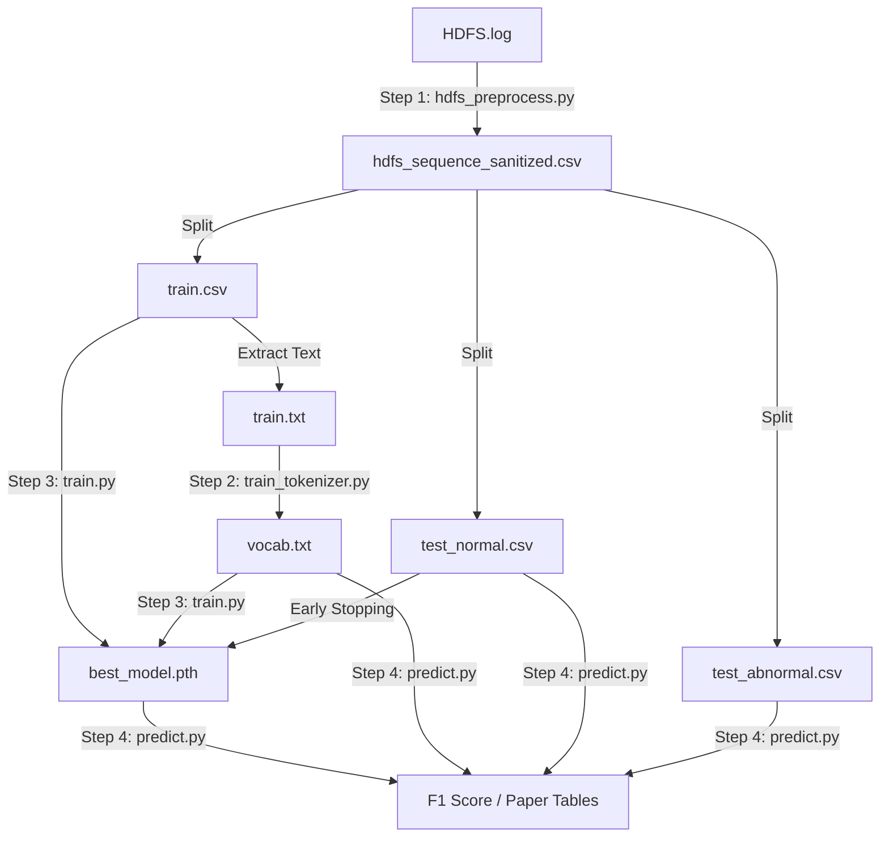

为了让你对整个实验流程的数据流向（Data Pipeline）一目了然，我将这些文件按**生成阶段**和**功能用途**进行了分类标注。

这些文件构成了你论文实验的完整证据链。

### 1. 核心产物 (The "Brain")
这是训练脚本最终生成的、价值最高的文件。

*   **`best_model.pth`**
    *   **来源**: `train.py` 在 Early Stopping 过程中保存的。
    *   **内容**: 包含两个关键对象：
        1.  `model_state_dict`: TinyBERT 的所有权重参数（已学会 HDFS 语法）。
        2.  `center`: 训练好的超球体中心向量（正常日志的“聚类中心”）。
    *   **用途**: **推理核心**。`predict.py` 将加载它来判断新日志离这个中心有多远。

### 2. 基础设施 (Infrastructure)
这是让 BERT 理解日志“语言”的字典。

*   **`vocab.txt`**
    *   **来源**: `train_tokenizer.py` (基于 `train.txt` 训练生成)。
    *   **内容**: 约 3000 行。每行一个 Token（如 `[BLK]`, `packet`, `##ponder`）。
    *   **用途**: **翻译官**。它负责把文本日志转换成数字 ID 序列。它是你“领域自适应（Domain Adaptation）”的核心证据。

### 3. 数据集划分 (Data Splits)
这是预处理脚本 `hdfs_preprocess.py` 将原始日志清洗并切分后的产物。

#### A. 训练组 (用于教模型什么是“正常”)
*   **`train.csv`**
    *   **内容**: 约 4855 条数据。**全都是正常样本 (Label=0)**。包含 `BlockId`, `EventSequence` 等列。
    *   **用途**: `train.py` 读取它进行训练。`train_tokenizer.py` 读取它建立词表。
*   **`train.txt`**
    *   **内容**: `train.csv` 的纯文本版本（去除了 BlockId 和表头）。
    *   **用途**: 专门喂给 `train_tokenizer.py` 的，因为 HuggingFace 的训练函数只吃纯文本。

#### B. 测试组 - 正常 (用于验证误报率 False Positive)
*   **`test_normal.csv`**
    *   **内容**: 未参与训练的正常样本。
    *   **用途**:
        1.  在 `train.py` 中作为 **验证集** (Validation Set) 指导 Early Stopping。
        2.  在 `predict.py` 中作为 **测试集**，模型**不应该**对它们报警。
*   **`test_normal.txt`**
    *   **内容**: 纯文本版本。
    *   **用途**: 兼容性备份，方便肉眼查看清洗效果。

#### C. 测试组 - 异常 (用于验证召回率 Recall)
*   **`test_abnormal.csv`**
    *   **内容**: HDFS 中所有的异常样本 (Label=1)。
    *   **用途**: **考卷**。在 `predict.py` 中使用。模型**必须**对它们报警。如果没报，就是漏报（False Negative）。
*   **`test_abnormal.txt`**
    *   **内容**: 纯文本版本。
    *   **用途**: 兼容性备份。

#### D. 总集 (Master Copy)
*   **`hdfs_sequence_sanitized.csv`**
    *   **内容**: 清洗后的全量数据。
    *   **用途**: **数据母版**。如果以后想改变 Train/Test 的切分比例（比如从 8:2 改成 5:5），不需要重新跑正则清洗，直接读这个文件重新切分即可。

---

### 数据流向图 (Data Flow)



所有文件都在它们该在的位置。现在，请开始编写最后的 **`predict.py`**，让我们看看这套系统的最终成绩单！

```
D:\develop\miniconda3\envs\berttorch\python.exe D:\OtherProjects\BERT-pytorch\HDFS\bt5_train.py 
[-] Random seed set to 42
[-] Training on cuda
[-] Loading data from ../output/hdfs/train.csv...
    Loaded 4855 samples.
[-] Splitting: Train=4370, Val=485
[-] Vocab Size: 424
[-] Initializing Hypersphere Center...
Init Center:   0%|          | 0/68 [00:00<?, ?it/s]D:\develop\miniconda3\envs\berttorch\lib\site-packages\transformers\models\bert\modeling_bert.py:435: UserWarning: 1Torch was not compiled with flash attention. (Triggered internally at C:\actions-runner\_work\pytorch\pytorch\builder\windows\pytorch\aten\src\ATen\native\transformers\cuda\sdp_utils.cpp:555.)
  attn_output = torch.nn.functional.scaled_dot_product_attention(
Init Center: 100%|██████████| 68/68 [00:24<00:00,  2.83it/s]
Epoch 1/50 [Train]:   0%|          | 0/68 [00:00<?, ?it/s][-] Center initialized. Norm: 2.2375
Epoch 1/50 [Train]: 100%|██████████| 68/68 [00:33<00:00,  2.03it/s, Loss=1.1260, MLM_Acc=49.16%]
Epoch 1: Train Loss=2.5890, Val Loss=1.0782, Train Acc=49.16%
    [*] Saving new best model...
Epoch 2/50 [Train]: 100%|██████████| 68/68 [00:33<00:00,  2.00it/s, Loss=0.7034, MLM_Acc=71.72%]
Epoch 2: Train Loss=0.9647, Val Loss=0.7875, Train Acc=71.72%
    [*] Saving new best model...
Epoch 3/50 [Train]: 100%|██████████| 68/68 [00:35<00:00,  1.94it/s, Loss=0.5328, MLM_Acc=75.20%]
Epoch 3: Train Loss=0.7751, Val Loss=0.6073, Train Acc=75.20%
    [*] Saving new best model...
Epoch 4/50 [Train]: 100%|██████████| 68/68 [00:34<00:00,  1.97it/s, Loss=0.6828, MLM_Acc=81.00%]
Epoch 4: Train Loss=0.6179, Val Loss=0.4753, Train Acc=81.00%
    [*] Saving new best model...
Epoch 5/50 [Train]: 100%|██████████| 68/68 [00:32<00:00,  2.07it/s, Loss=0.6880, MLM_Acc=83.94%]
Epoch 5: Train Loss=0.5276, Val Loss=0.4019, Train Acc=83.94%
    [*] Saving new best model...
Epoch 6/50 [Train]: 100%|██████████| 68/68 [00:32<00:00,  2.07it/s, Loss=0.3838, MLM_Acc=86.20%]
Epoch 6: Train Loss=0.4619, Val Loss=0.3694, Train Acc=86.20%
    [*] Saving new best model...
Epoch 7/50 [Train]: 100%|██████████| 68/68 [00:33<00:00,  2.00it/s, Loss=0.2537, MLM_Acc=87.86%]
Epoch 7: Train Loss=0.4126, Val Loss=0.3380, Train Acc=87.86%
    [*] Saving new best model...
Epoch 8/50 [Train]: 100%|██████████| 68/68 [00:34<00:00,  1.99it/s, Loss=0.1764, MLM_Acc=88.90%]
Epoch 8: Train Loss=0.3797, Val Loss=0.3003, Train Acc=88.90%
    [*] Saving new best model...
Epoch 9/50 [Train]: 100%|██████████| 68/68 [00:32<00:00,  2.08it/s, Loss=0.3113, MLM_Acc=89.69%]
Epoch 9: Train Loss=0.3489, Val Loss=0.2786, Train Acc=89.69%
    [*] Saving new best model...
Epoch 10/50 [Train]: 100%|██████████| 68/68 [00:32<00:00,  2.08it/s, Loss=0.2645, MLM_Acc=90.23%]
Epoch 10: Train Loss=0.3286, Val Loss=0.2453, Train Acc=90.23%
    [*] Saving new best model...
Epoch 11/50 [Train]: 100%|██████████| 68/68 [00:33<00:00,  2.02it/s, Loss=0.2825, MLM_Acc=90.40%]
Epoch 11: Train Loss=0.3230, Val Loss=0.2444, Train Acc=90.40%
    [*] Saving new best model...
Epoch 12/50 [Train]: 100%|██████████| 68/68 [00:35<00:00,  1.92it/s, Loss=0.2315, MLM_Acc=91.13%]
Epoch 12: Train Loss=0.2962, Val Loss=0.2300, Train Acc=91.13%
    [*] Saving new best model...
Epoch 13/50 [Train]: 100%|██████████| 68/68 [00:34<00:00,  1.99it/s, Loss=0.3062, MLM_Acc=91.57%]
Epoch 13: Train Loss=0.2796, Val Loss=0.2181, Train Acc=91.57%
    [*] Saving new best model...
Epoch 14/50 [Train]: 100%|██████████| 68/68 [00:35<00:00,  1.93it/s, Loss=0.1374, MLM_Acc=91.67%]
Epoch 14: Train Loss=0.2757, Val Loss=0.2150, Train Acc=91.67%
    [*] Saving new best model...
Epoch 15/50 [Train]: 100%|██████████| 68/68 [00:33<00:00,  2.03it/s, Loss=0.3140, MLM_Acc=92.09%]
Epoch 15: Train Loss=0.2635, Val Loss=0.2003, Train Acc=92.09%
    [*] Saving new best model...
Epoch 16/50 [Train]: 100%|██████████| 68/68 [00:33<00:00,  2.06it/s, Loss=0.1660, MLM_Acc=92.16%]
Epoch 16: Train Loss=0.2611, Val Loss=0.1901, Train Acc=92.16%
    [*] Saving new best model...
Epoch 17/50 [Train]: 100%|██████████| 68/68 [00:34<00:00,  2.00it/s, Loss=0.1487, MLM_Acc=92.42%]
Epoch 17: Train Loss=0.2499, Val Loss=0.1871, Train Acc=92.42%
    [*] Saving new best model...
Epoch 18/50 [Train]: 100%|██████████| 68/68 [00:34<00:00,  1.96it/s, Loss=0.2198, MLM_Acc=92.57%]
Epoch 19/50 [Train]:   0%|          | 0/68 [00:00<?, ?it/s]Epoch 18: Train Loss=0.2480, Val Loss=0.1932, Train Acc=92.57%
    [!] Patience: 1/3
Epoch 19/50 [Train]: 100%|██████████| 68/68 [00:33<00:00,  2.03it/s, Loss=0.2342, MLM_Acc=92.90%]
Epoch 20/50 [Train]:   0%|          | 0/68 [00:00<?, ?it/s]Epoch 19: Train Loss=0.2366, Val Loss=0.1898, Train Acc=92.90%
    [!] Patience: 2/3
Epoch 20/50 [Train]: 100%|██████████| 68/68 [00:33<00:00,  2.00it/s, Loss=0.1470, MLM_Acc=93.05%]
Epoch 20: Train Loss=0.2285, Val Loss=0.1732, Train Acc=93.05%
    [*] Saving new best model...
Epoch 21/50 [Train]: 100%|██████████| 68/68 [00:33<00:00,  2.02it/s, Loss=0.2445, MLM_Acc=93.31%]
Epoch 21: Train Loss=0.2193, Val Loss=0.1674, Train Acc=93.31%
    [*] Saving new best model...
Epoch 22/50 [Train]: 100%|██████████| 68/68 [00:33<00:00,  2.02it/s, Loss=0.1498, MLM_Acc=93.59%]
Epoch 22: Train Loss=0.2108, Val Loss=0.1635, Train Acc=93.59%
    [*] Saving new best model...
Epoch 23/50 [Train]: 100%|██████████| 68/68 [00:35<00:00,  1.92it/s, Loss=0.2992, MLM_Acc=93.66%]
Epoch 23: Train Loss=0.2047, Val Loss=0.1506, Train Acc=93.66%
    [*] Saving new best model...
Epoch 24/50 [Train]: 100%|██████████| 68/68 [00:34<00:00,  1.96it/s, Loss=0.1739, MLM_Acc=93.93%]
Epoch 24: Train Loss=0.1975, Val Loss=0.1477, Train Acc=93.93%
    [*] Saving new best model...
Epoch 25/50 [Train]: 100%|██████████| 68/68 [00:35<00:00,  1.93it/s, Loss=0.1732, MLM_Acc=94.04%]
Epoch 25: Train Loss=0.1914, Val Loss=0.1484, Train Acc=94.04%
    [!] Patience: 1/3
Epoch 26/50 [Train]: 100%|██████████| 68/68 [00:35<00:00,  1.91it/s, Loss=0.1725, MLM_Acc=94.16%]
Epoch 26: Train Loss=0.1873, Val Loss=0.1457, Train Acc=94.16%
    [*] Saving new best model...
Epoch 27/50 [Train]: 100%|██████████| 68/68 [00:35<00:00,  1.93it/s, Loss=0.1960, MLM_Acc=94.49%]
Epoch 27: Train Loss=0.1756, Val Loss=0.1275, Train Acc=94.49%
    [*] Saving new best model...
Epoch 28/50 [Train]: 100%|██████████| 68/68 [00:33<00:00,  2.03it/s, Loss=0.2525, MLM_Acc=94.58%]
Epoch 28: Train Loss=0.1717, Val Loss=0.1308, Train Acc=94.58%
    [!] Patience: 1/3
Epoch 29/50 [Train]: 100%|██████████| 68/68 [00:33<00:00,  2.03it/s, Loss=0.2512, MLM_Acc=94.81%]
Epoch 29: Train Loss=0.1627, Val Loss=0.1177, Train Acc=94.81%
    [*] Saving new best model...
Epoch 30/50 [Train]: 100%|██████████| 68/68 [00:32<00:00,  2.07it/s, Loss=0.1081, MLM_Acc=94.80%]
Epoch 31/50 [Train]:   0%|          | 0/68 [00:00<?, ?it/s]Epoch 30: Train Loss=0.1620, Val Loss=0.1219, Train Acc=94.80%
    [!] Patience: 1/3
Epoch 31/50 [Train]: 100%|██████████| 68/68 [00:33<00:00,  2.03it/s, Loss=0.1385, MLM_Acc=95.24%]
Epoch 31: Train Loss=0.1466, Val Loss=0.1082, Train Acc=95.24%
    [*] Saving new best model...
Epoch 32/50 [Train]: 100%|██████████| 68/68 [00:33<00:00,  2.01it/s, Loss=0.1271, MLM_Acc=95.33%]
Epoch 32: Train Loss=0.1425, Val Loss=0.0958, Train Acc=95.33%
    [*] Saving new best model...
Epoch 33/50 [Train]: 100%|██████████| 68/68 [00:34<00:00,  1.95it/s, Loss=0.0807, MLM_Acc=95.50%]
Epoch 33: Train Loss=0.1357, Val Loss=0.0904, Train Acc=95.50%
    [*] Saving new best model...
Epoch 34/50 [Train]: 100%|██████████| 68/68 [00:34<00:00,  1.97it/s, Loss=0.1256, MLM_Acc=95.71%]
Epoch 34: Train Loss=0.1269, Val Loss=0.0864, Train Acc=95.71%
    [*] Saving new best model...
Epoch 35/50 [Train]: 100%|██████████| 68/68 [00:33<00:00,  2.00it/s, Loss=0.1378, MLM_Acc=96.02%]
Epoch 35: Train Loss=0.1178, Val Loss=0.0714, Train Acc=96.02%
    [*] Saving new best model...
Epoch 36/50 [Train]: 100%|██████████| 68/68 [00:33<00:00,  2.01it/s, Loss=0.1651, MLM_Acc=96.15%]
Epoch 36: Train Loss=0.1138, Val Loss=0.0683, Train Acc=96.15%
    [*] Saving new best model...
Epoch 37/50 [Train]: 100%|██████████| 68/68 [00:34<00:00,  1.98it/s, Loss=0.1681, MLM_Acc=96.41%]
Epoch 37: Train Loss=0.1054, Val Loss=0.0595, Train Acc=96.41%
    [*] Saving new best model...
Epoch 38/50 [Train]: 100%|██████████| 68/68 [00:34<00:00,  1.98it/s, Loss=0.0639, MLM_Acc=96.77%]
Epoch 38: Train Loss=0.0955, Val Loss=0.0513, Train Acc=96.77%
    [*] Saving new best model...
Epoch 39/50 [Train]: 100%|██████████| 68/68 [00:32<00:00,  2.06it/s, Loss=0.1489, MLM_Acc=96.89%]
Epoch 39: Train Loss=0.0921, Val Loss=0.0459, Train Acc=96.89%
    [*] Saving new best model...
Epoch 40/50 [Train]: 100%|██████████| 68/68 [00:33<00:00,  2.04it/s, Loss=0.0805, MLM_Acc=97.16%]
Epoch 40: Train Loss=0.0843, Val Loss=0.0448, Train Acc=97.16%
    [*] Saving new best model...
Epoch 41/50 [Train]: 100%|██████████| 68/68 [00:33<00:00,  2.01it/s, Loss=0.0384, MLM_Acc=97.35%]
Epoch 41: Train Loss=0.0780, Val Loss=0.0357, Train Acc=97.35%
    [*] Saving new best model...
Epoch 42/50 [Train]: 100%|██████████| 68/68 [00:33<00:00,  2.00it/s, Loss=0.0442, MLM_Acc=97.64%]
Epoch 42: Train Loss=0.0711, Val Loss=0.0319, Train Acc=97.64%
    [*] Saving new best model...
Epoch 43/50 [Train]: 100%|██████████| 68/68 [00:34<00:00,  1.98it/s, Loss=0.0359, MLM_Acc=97.84%]
Epoch 43: Train Loss=0.0655, Val Loss=0.0268, Train Acc=97.84%
    [*] Saving new best model...
Epoch 44/50 [Train]: 100%|██████████| 68/68 [00:32<00:00,  2.06it/s, Loss=0.0708, MLM_Acc=98.11%]
Epoch 44: Train Loss=0.0585, Val Loss=0.0264, Train Acc=98.11%
    [*] Saving new best model...
Epoch 45/50 [Train]: 100%|██████████| 68/68 [00:32<00:00,  2.07it/s, Loss=0.0501, MLM_Acc=98.18%]
Epoch 45: Train Loss=0.0556, Val Loss=0.0211, Train Acc=98.18%
    [*] Saving new best model...
Epoch 46/50 [Train]: 100%|██████████| 68/68 [00:32<00:00,  2.07it/s, Loss=0.0496, MLM_Acc=98.34%]
Epoch 47/50 [Train]:   0%|          | 0/68 [00:00<?, ?it/s]Epoch 46: Train Loss=0.0509, Val Loss=0.0214, Train Acc=98.34%
    [!] Patience: 1/3
Epoch 47/50 [Train]: 100%|██████████| 68/68 [00:32<00:00,  2.06it/s, Loss=0.0468, MLM_Acc=98.46%]
Epoch 47: Train Loss=0.0477, Val Loss=0.0166, Train Acc=98.46%
    [*] Saving new best model...
Epoch 48/50 [Train]: 100%|██████████| 68/68 [00:32<00:00,  2.07it/s, Loss=0.0259, MLM_Acc=98.61%]
Epoch 48: Train Loss=0.0432, Val Loss=0.0153, Train Acc=98.61%
    [*] Saving new best model...
Epoch 49/50 [Train]: 100%|██████████| 68/68 [00:32<00:00,  2.06it/s, Loss=0.0392, MLM_Acc=98.66%]
Epoch 49: Train Loss=0.0407, Val Loss=0.0133, Train Acc=98.66%
    [*] Saving new best model...
Epoch 50/50 [Train]: 100%|██████████| 68/68 [00:32<00:00,  2.07it/s, Loss=0.0362, MLM_Acc=98.89%]
Epoch 50: Train Loss=0.0352, Val Loss=0.0117, Train Acc=98.89%
    [*] Saving new best model...

Process finished with exit code 0
```
```
D:\develop\miniconda3\envs\berttorch\python.exe -X pycache_prefix=C:\Users\Philister\AppData\Local\JetBrains\PyCharm2024.3\cpython-cache "D:/Program Files/JetBrains/PyCharm 2024.3.6/plugins/python-ce/helpers/pydev/pydevd.py" --multiprocess --qt-support=auto --client 127.0.0.1 --port 4138 --file D:\OtherProjects\BERT-pytorch\HDFS\bp6_predict.py 
Connected to pydev debugger (build 243.26574.90)
[-] Loading model...
D:\OtherProjects\BERT-pytorch\HDFS\bp6_predict.py:127: FutureWarning: You are using `torch.load` with `weights_only=False` (the current default value), which uses the default pickle module implicitly. It is possible to construct malicious pickle data which will execute arbitrary code during unpickling (See https://github.com/pytorch/pytorch/blob/main/SECURITY.md#untrusted-models for more details). In a future release, the default value for `weights_only` will be flipped to `True`. This limits the functions that could be executed during unpickling. Arbitrary objects will no longer be allowed to be loaded via this mode unless they are explicitly allowlisted by the user via `torch.serialization.add_safe_globals`. We recommend you start setting `weights_only=True` for any use case where you don't have full control of the loaded file. Please open an issue on GitHub for any issues related to this experimental feature.
  checkpoint = torch.load(cfg.model_path, map_location=cfg.device)  # , weights_only=True)
[-] Loading data from ../output/hdfs/test_normal.csv...
[-] Loading data from ../output/hdfs/test_abnormal.csv...

============================================================
FINAL TOP-K EVALUATION (Ratio=0.1)
============================================================
[-] Scoring Top-5...
Inference (Top-5):   0%|          | 0/109 [00:00<?, ?it/s]D:\develop\miniconda3\envs\berttorch\lib\site-packages\transformers\models\bert\modeling_bert.py:435: UserWarning: 1Torch was not compiled with flash attention. (Triggered internally at C:\actions-runner\_work\pytorch\pytorch\builder\windows\pytorch\aten\src\ATen\native\transformers\cuda\sdp_utils.cpp:555.)
  attn_output = torch.nn.functional.scaled_dot_product_attention(
Inference (Top-5): 100%|██████████| 109/109 [03:19<00:00,  1.83s/it]
Inference (Top-5): 100%|██████████| 4/4 [00:41<00:00, 10.31s/it]
Strategy: Top-5  | Best F1: 0.8532 | AUC: 0.9136
[-] Scoring Top-10...
Inference (Top-10): 100%|██████████| 109/109 [03:20<00:00,  1.84s/it]
Inference (Top-10): 100%|██████████| 4/4 [00:42<00:00, 10.53s/it]
Strategy: Top-10 | Best F1: 0.8855 | AUC: 0.9145
============================================================

Process finished with exit code 0
```