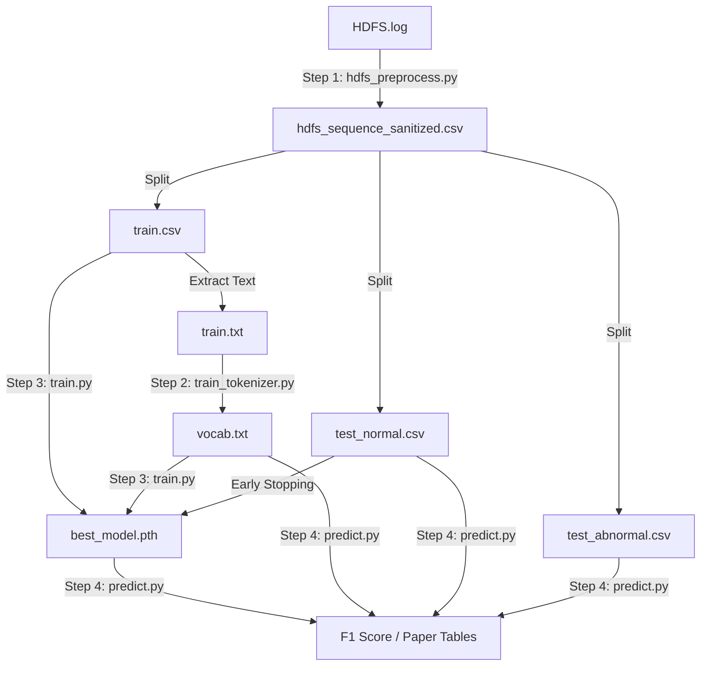

为了让你对整个实验流程的数据流向（Data Pipeline）一目了然，我将这些文件按**生成阶段**和**功能用途**进行了分类标注。

这些文件构成了你论文实验的完整证据链。

### 1. 核心产物 (The "Brain")
这是训练脚本最终生成的、价值最高的文件。

*   **`best_model.pth`**
    *   **来源**: `train.py` 在 Early Stopping 过程中保存的。
    *   **内容**: 包含两个关键对象：
        1.  `model_state_dict`: TinyBERT 的所有权重参数（已学会 HDFS 语法）。
        2.  `center`: 训练好的超球体中心向量（正常日志的“聚类中心”）。
    *   **用途**: **推理核心**。`predict.py` 将加载它来判断新日志离这个中心有多远。

### 2. 基础设施 (Infrastructure)
这是让 BERT 理解日志“语言”的字典。

*   **`vocab.txt`**
    *   **来源**: `train_tokenizer.py` (基于 `train.txt` 训练生成)。
    *   **内容**: 约 3000 行。每行一个 Token（如 `[BLK]`, `packet`, `##ponder`）。
    *   **用途**: **翻译官**。它负责把文本日志转换成数字 ID 序列。它是你“领域自适应（Domain Adaptation）”的核心证据。

### 3. 数据集划分 (Data Splits)
这是预处理脚本 `hdfs_preprocess.py` 将原始日志清洗并切分后的产物。

#### A. 训练组 (用于教模型什么是“正常”)
*   **`train.csv`**
    *   **内容**: 约 4855 条数据。**全都是正常样本 (Label=0)**。包含 `BlockId`, `EventSequence` 等列。
    *   **用途**: `train.py` 读取它进行训练。`train_tokenizer.py` 读取它建立词表。
*   **`train.txt`**
    *   **内容**: `train.csv` 的纯文本版本（去除了 BlockId 和表头）。
    *   **用途**: 专门喂给 `train_tokenizer.py` 的，因为 HuggingFace 的训练函数只吃纯文本。

#### B. 测试组 - 正常 (用于验证误报率 False Positive)
*   **`test_normal.csv`**
    *   **内容**: 未参与训练的正常样本。
    *   **用途**:
        1.  在 `train.py` 中作为 **验证集** (Validation Set) 指导 Early Stopping。
        2.  在 `predict.py` 中作为 **测试集**，模型**不应该**对它们报警。
*   **`test_normal.txt`**
    *   **内容**: 纯文本版本。
    *   **用途**: 兼容性备份，方便肉眼查看清洗效果。

#### C. 测试组 - 异常 (用于验证召回率 Recall)
*   **`test_abnormal.csv`**
    *   **内容**: HDFS 中所有的异常样本 (Label=1)。
    *   **用途**: **考卷**。在 `predict.py` 中使用。模型**必须**对它们报警。如果没报，就是漏报（False Negative）。
*   **`test_abnormal.txt`**
    *   **内容**: 纯文本版本。
    *   **用途**: 兼容性备份。

#### D. 总集 (Master Copy)
*   **`hdfs_sequence_sanitized.csv`**
    *   **内容**: 清洗后的全量数据。
    *   **用途**: **数据母版**。如果以后想改变 Train/Test 的切分比例（比如从 8:2 改成 5:5），不需要重新跑正则清洗，直接读这个文件重新切分即可。

---

### 数据流向图 (Data Flow)



所有文件都在它们该在的位置。现在，请开始编写最后的 **`predict.py`**，让我们看看这套系统的最终成绩单！

```
D:\develop\miniconda3\envs\berttorch\python.exe D:\OtherProjects\BERT-pytorch\HDFS\bt5_train.py 
[-] Random seed set to 42
[-] Training on cuda
[-] Loading data from ../output/hdfs/train.csv...
    Loaded 4855 samples.
[-] Splitting: Train=4370, Val=485
[-] Vocab Size: 424
[-] Initializing Hypersphere Center...
Init Center:   0%|          | 0/68 [00:00<?, ?it/s]D:\develop\miniconda3\envs\berttorch\lib\site-packages\transformers\models\bert\modeling_bert.py:435: UserWarning: 1Torch was not compiled with flash attention. (Triggered internally at C:\actions-runner\_work\pytorch\pytorch\builder\windows\pytorch\aten\src\ATen\native\transformers\cuda\sdp_utils.cpp:555.)
  attn_output = torch.nn.functional.scaled_dot_product_attention(
Init Center: 100%|██████████| 68/68 [00:21<00:00,  3.12it/s]
[-] Center initialized. Norm: 2.2295
Epoch 1/50 [Train]: 100%|██████████| 68/68 [00:24<00:00,  2.76it/s, Loss=0.8494, MLM_Acc=53.62%]
Epoch 1: Train Loss=2.2211, Val Loss=0.8185, Train Acc=53.62%
    [*] Saving new best model...
Epoch 2/50 [Train]: 100%|██████████| 68/68 [00:24<00:00,  2.74it/s, Loss=0.2965, MLM_Acc=79.62%]
Epoch 2: Train Loss=0.5808, Val Loss=0.2288, Train Acc=79.62%
    [*] Saving new best model...
Epoch 3/50 [Train]: 100%|██████████| 68/68 [00:24<00:00,  2.78it/s, Loss=0.1420, MLM_Acc=96.11%]
Epoch 3: Train Loss=0.1777, Val Loss=0.0808, Train Acc=96.11%
    [*] Saving new best model...
Epoch 4/50 [Train]: 100%|██████████| 68/68 [00:24<00:00,  2.77it/s, Loss=0.0846, MLM_Acc=98.06%]
Epoch 4: Train Loss=0.0988, Val Loss=0.0536, Train Acc=98.06%
    [*] Saving new best model...
Epoch 5/50 [Train]: 100%|██████████| 68/68 [00:24<00:00,  2.77it/s, Loss=0.0702, MLM_Acc=98.56%]
Epoch 5: Train Loss=0.0712, Val Loss=0.0406, Train Acc=98.56%
    [*] Saving new best model...
Epoch 6/50 [Train]: 100%|██████████| 68/68 [00:24<00:00,  2.74it/s, Loss=0.0250, MLM_Acc=98.84%]
Epoch 6: Train Loss=0.0603, Val Loss=0.0308, Train Acc=98.84%
    [*] Saving new best model...
Epoch 7/50 [Train]: 100%|██████████| 68/68 [00:24<00:00,  2.72it/s, Loss=0.0160, MLM_Acc=98.94%]
Epoch 7: Train Loss=0.0512, Val Loss=0.0301, Train Acc=98.94%
    [*] Saving new best model...
Epoch 8/50 [Train]: 100%|██████████| 68/68 [00:24<00:00,  2.82it/s, Loss=0.0109, MLM_Acc=99.08%]
Epoch 8: Train Loss=0.0467, Val Loss=0.0204, Train Acc=99.08%
    [*] Saving new best model...
Epoch 9/50 [Train]: 100%|██████████| 68/68 [00:24<00:00,  2.74it/s, Loss=0.0087, MLM_Acc=99.18%]
Epoch 9: Train Loss=0.0370, Val Loss=0.0138, Train Acc=99.18%
    [*] Saving new best model...
Epoch 10/50 [Train]: 100%|██████████| 68/68 [00:23<00:00,  2.84it/s, Loss=0.0188, MLM_Acc=99.33%]
Epoch 10: Train Loss=0.0294, Val Loss=0.0163, Train Acc=99.33%
    [!] Patience: 1/3
Epoch 11/50 [Train]: 100%|██████████| 68/68 [00:24<00:00,  2.82it/s, Loss=0.0423, MLM_Acc=99.39%]
Epoch 11: Train Loss=0.0269, Val Loss=0.0073, Train Acc=99.39%
    [*] Saving new best model...
Epoch 12/50 [Train]: 100%|██████████| 68/68 [00:24<00:00,  2.75it/s, Loss=0.0114, MLM_Acc=99.41%]
Epoch 12: Train Loss=0.0257, Val Loss=0.0062, Train Acc=99.41%
    [*] Saving new best model...
Epoch 13/50 [Train]: 100%|██████████| 68/68 [00:24<00:00,  2.75it/s, Loss=0.0053, MLM_Acc=99.56%]
Epoch 14/50 [Train]:   0%|          | 0/68 [00:00<?, ?it/s]Epoch 13: Train Loss=0.0194, Val Loss=0.0068, Train Acc=99.56%
    [!] Patience: 1/3
Epoch 14/50 [Train]: 100%|██████████| 68/68 [00:24<00:00,  2.80it/s, Loss=0.0276, MLM_Acc=99.60%]
Epoch 15/50 [Train]:   0%|          | 0/68 [00:00<?, ?it/s]Epoch 14: Train Loss=0.0173, Val Loss=0.0076, Train Acc=99.60%
    [!] Patience: 2/3
Epoch 15/50 [Train]: 100%|██████████| 68/68 [00:24<00:00,  2.81it/s, Loss=0.0302, MLM_Acc=99.60%]
Epoch 15: Train Loss=0.0161, Val Loss=0.0067, Train Acc=99.60%
    [!] Patience: 3/3
    [STOP] Early stopping triggered.
```
```
D:\develop\miniconda3\envs\berttorch\python.exe D:\OtherProjects\BERT-pytorch\HDFS\bp6_predict.py 
[-] Random seed set to 42
[-] Loading model from ../output/hdfs/best_model.pth
[-] Loading data from ../output/hdfs/test_normal.csv...
    Loaded 553368 samples.
[-] Vocab Size: 424
[-] Model loaded. Center norm: 2.2295
[-] Loading data from ../output/hdfs/test_normal.csv...
    Loaded 553368 samples.
[-] Normal Sampling: 10.0% (55336/553368)
[-] Loading data from ../output/hdfs/test_abnormal.csv...
    Loaded 16838 samples.
[-] Abnormal Sampling: 10.0% (1683/16838)
[-] Computing scores...
Inference (Max-Strat):   0%|          | 0/109 [00:00<?, ?it/s]D:\develop\miniconda3\envs\berttorch\lib\site-packages\transformers\models\bert\modeling_bert.py:435: UserWarning: 1Torch was not compiled with flash attention. (Triggered internally at C:\actions-runner\_work\pytorch\pytorch\builder\windows\pytorch\aten\src\ATen\native\transformers\cuda\sdp_utils.cpp:555.)
  attn_output = torch.nn.functional.scaled_dot_product_attention(
Inference (Max-Strat): 100%|██████████| 109/109 [01:29<00:00,  1.21it/s]
Inference (Max-Strat): 100%|██████████| 4/4 [00:24<00:00,  6.00s/it]

============================================================
FINAL EVALUATION REPORT (Ratio=0.1)
============================================================
Strategy: Distance Only        | Best F1: 0.1848 | AUC: 0.5249
Strategy: MLM (Mean)           | Best F1: 0.3718 | AUC: 0.6737
Strategy: MLM (Max)            | Best F1: 0.3787 | AUC: 0.6503
Strategy: Hybrid (Max+Dist)    | Best F1: 0.3787 | AUC: 0.6640
============================================================
[-] Benchmark saved to ../output/hdfs/

Process finished with exit code 0
```