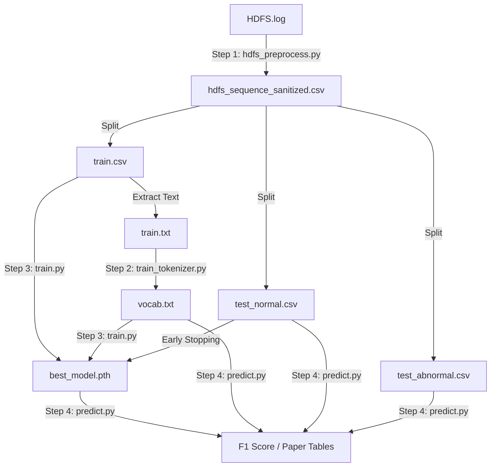

为了让你对整个实验流程的数据流向（Data Pipeline）一目了然，我将这些文件按**生成阶段**和**功能用途**进行了分类标注。

这些文件构成了你论文实验的完整证据链。

### 1. 核心产物 (The "Brain")
这是训练脚本最终生成的、价值最高的文件。

*   **`best_model.pth`**
    *   **来源**: `train.py` 在 Early Stopping 过程中保存的。
    *   **内容**: 包含两个关键对象：
        1.  `model_state_dict`: TinyBERT 的所有权重参数（已学会 HDFS 语法）。
        2.  `center`: 训练好的超球体中心向量（正常日志的“聚类中心”）。
    *   **用途**: **推理核心**。`predict.py` 将加载它来判断新日志离这个中心有多远。

### 2. 基础设施 (Infrastructure)
这是让 BERT 理解日志“语言”的字典。

*   **`vocab.txt`**
    *   **来源**: `train_tokenizer.py` (基于 `train.txt` 训练生成)。
    *   **内容**: 约 3000 行。每行一个 Token（如 `[BLK]`, `packet`, `##ponder`）。
    *   **用途**: **翻译官**。它负责把文本日志转换成数字 ID 序列。它是你“领域自适应（Domain Adaptation）”的核心证据。

### 3. 数据集划分 (Data Splits)
这是预处理脚本 `hdfs_preprocess.py` 将原始日志清洗并切分后的产物。

#### A. 训练组 (用于教模型什么是“正常”)
*   **`train.csv`**
    *   **内容**: 约 4855 条数据。**全都是正常样本 (Label=0)**。包含 `BlockId`, `EventSequence` 等列。
    *   **用途**: `train.py` 读取它进行训练。`train_tokenizer.py` 读取它建立词表。
*   **`train.txt`**
    *   **内容**: `train.csv` 的纯文本版本（去除了 BlockId 和表头）。
    *   **用途**: 专门喂给 `train_tokenizer.py` 的，因为 HuggingFace 的训练函数只吃纯文本。

#### B. 测试组 - 正常 (用于验证误报率 False Positive)
*   **`test_normal.csv`**
    *   **内容**: 未参与训练的正常样本。
    *   **用途**:
        1.  在 `train.py` 中作为 **验证集** (Validation Set) 指导 Early Stopping。
        2.  在 `predict.py` 中作为 **测试集**，模型**不应该**对它们报警。
*   **`test_normal.txt`**
    *   **内容**: 纯文本版本。
    *   **用途**: 兼容性备份，方便肉眼查看清洗效果。

#### C. 测试组 - 异常 (用于验证召回率 Recall)
*   **`test_abnormal.csv`**
    *   **内容**: HDFS 中所有的异常样本 (Label=1)。
    *   **用途**: **考卷**。在 `predict.py` 中使用。模型**必须**对它们报警。如果没报，就是漏报（False Negative）。
*   **`test_abnormal.txt`**
    *   **内容**: 纯文本版本。
    *   **用途**: 兼容性备份。

#### D. 总集 (Master Copy)
*   **`hdfs_sequence_sanitized.csv`**
    *   **内容**: 清洗后的全量数据。
    *   **用途**: **数据母版**。如果以后想改变 Train/Test 的切分比例（比如从 8:2 改成 5:5），不需要重新跑正则清洗，直接读这个文件重新切分即可。

---

### 数据流向图 (Data Flow)



所有文件都在它们该在的位置。现在，请开始编写最后的 **`predict.py`**，让我们看看这套系统的最终成绩单！

```angular2html
D:\develop\miniconda3\envs\berttorch\python.exe D:\OtherProjects\BERT-pytorch\hdfs\bt5_train.py 
[-] Random seed set to 42
[-] Training on cuda
[-] Loading data from ../output/hdfs/train.csv...
    Loaded 4855 samples.
[-] Splitting: Train=4370, Val=485
[-] Vocab Size: 424
[-] Initializing Hypersphere Center...
Init Center:   0%|          | 0/68 [00:00<?, ?it/s]D:\develop\miniconda3\envs\berttorch\lib\site-packages\transformers\models\bert\modeling_bert.py:435: UserWarning: 1Torch was not compiled with flash attention. (Triggered internally at C:\actions-runner\_work\pytorch\pytorch\builder\windows\pytorch\aten\src\ATen\native\transformers\cuda\sdp_utils.cpp:555.)
  attn_output = torch.nn.functional.scaled_dot_product_attention(
Init Center: 100%|██████████| 68/68 [00:23<00:00,  2.90it/s]
Epoch 1/50 [Train]:   0%|          | 0/68 [00:00<?, ?it/s][-] Center initialized. Norm: 2.2375
Epoch 1/50 [Train]: 100%|██████████| 68/68 [00:33<00:00,  2.03it/s, Loss=1.1260, MLM_Acc=49.16%]
Epoch 1: Train Loss=2.5890, Val Loss=1.0782, Train Acc=49.16%
    [*] Saving new best model...
Epoch 2/50 [Train]: 100%|██████████| 68/68 [00:33<00:00,  2.03it/s, Loss=0.7034, MLM_Acc=71.72%]
Epoch 2: Train Loss=0.9647, Val Loss=0.7875, Train Acc=71.72%
    [*] Saving new best model...
Epoch 3/50 [Train]: 100%|██████████| 68/68 [00:33<00:00,  2.05it/s, Loss=0.5328, MLM_Acc=75.20%]
Epoch 3: Train Loss=0.7751, Val Loss=0.6073, Train Acc=75.20%
    [*] Saving new best model...
Epoch 4/50 [Train]: 100%|██████████| 68/68 [00:33<00:00,  2.05it/s, Loss=0.6828, MLM_Acc=81.00%]
Epoch 4: Train Loss=0.6179, Val Loss=0.4753, Train Acc=81.00%
    [*] Saving new best model...
Epoch 5/50 [Train]: 100%|██████████| 68/68 [00:33<00:00,  2.05it/s, Loss=0.6880, MLM_Acc=83.94%]
Epoch 5: Train Loss=0.5276, Val Loss=0.4019, Train Acc=83.94%
    [*] Saving new best model...
Epoch 6/50 [Train]: 100%|██████████| 68/68 [00:33<00:00,  2.05it/s, Loss=0.3838, MLM_Acc=86.20%]
Epoch 6: Train Loss=0.4619, Val Loss=0.3694, Train Acc=86.20%
    [*] Saving new best model...
Epoch 7/50 [Train]: 100%|██████████| 68/68 [00:33<00:00,  2.04it/s, Loss=0.2537, MLM_Acc=87.86%]
Epoch 7: Train Loss=0.4126, Val Loss=0.3380, Train Acc=87.86%
    [*] Saving new best model...
Epoch 8/50 [Train]: 100%|██████████| 68/68 [00:33<00:00,  2.05it/s, Loss=0.1764, MLM_Acc=88.90%]
Epoch 8: Train Loss=0.3797, Val Loss=0.3003, Train Acc=88.90%
    [*] Saving new best model...
Epoch 9/50 [Train]: 100%|██████████| 68/68 [00:33<00:00,  2.04it/s, Loss=0.3113, MLM_Acc=89.69%]
Epoch 9: Train Loss=0.3489, Val Loss=0.2786, Train Acc=89.69%
    [*] Saving new best model...
Epoch 10/50 [Train]: 100%|██████████| 68/68 [00:33<00:00,  2.04it/s, Loss=0.2645, MLM_Acc=90.23%]
Epoch 10: Train Loss=0.3286, Val Loss=0.2453, Train Acc=90.23%
    [*] Saving new best model...
Epoch 11/50 [Train]: 100%|██████████| 68/68 [00:33<00:00,  2.03it/s, Loss=0.2825, MLM_Acc=90.40%]
Epoch 11: Train Loss=0.3230, Val Loss=0.2444, Train Acc=90.40%
    [*] Saving new best model...
Epoch 12/50 [Train]: 100%|██████████| 68/68 [00:33<00:00,  2.03it/s, Loss=0.2315, MLM_Acc=91.13%]
Epoch 12: Train Loss=0.2962, Val Loss=0.2300, Train Acc=91.13%
    [*] Saving new best model...
Epoch 13/50 [Train]: 100%|██████████| 68/68 [00:33<00:00,  2.04it/s, Loss=0.3061, MLM_Acc=91.57%]
Epoch 13: Train Loss=0.2796, Val Loss=0.2181, Train Acc=91.57%
    [*] Saving new best model...
Epoch 14/50 [Train]: 100%|██████████| 68/68 [00:33<00:00,  2.04it/s, Loss=0.1373, MLM_Acc=91.67%]
Epoch 14: Train Loss=0.2757, Val Loss=0.2149, Train Acc=91.67%
    [*] Saving new best model...
Epoch 15/50 [Train]: 100%|██████████| 68/68 [00:33<00:00,  2.03it/s, Loss=0.3141, MLM_Acc=92.09%]
Epoch 15: Train Loss=0.2635, Val Loss=0.2003, Train Acc=92.09%
    [*] Saving new best model...
Epoch 16/50 [Train]: 100%|██████████| 68/68 [00:33<00:00,  2.04it/s, Loss=0.1660, MLM_Acc=92.15%]
Epoch 16: Train Loss=0.2611, Val Loss=0.1901, Train Acc=92.15%
    [*] Saving new best model...
Epoch 17/50 [Train]: 100%|██████████| 68/68 [00:33<00:00,  2.05it/s, Loss=0.1490, MLM_Acc=92.42%]
Epoch 17: Train Loss=0.2498, Val Loss=0.1871, Train Acc=92.42%
    [*] Saving new best model...
Epoch 18/50 [Train]: 100%|██████████| 68/68 [00:33<00:00,  2.05it/s, Loss=0.2191, MLM_Acc=92.57%]
Epoch 19/50 [Train]:   0%|          | 0/68 [00:00<?, ?it/s]Epoch 18: Train Loss=0.2479, Val Loss=0.1931, Train Acc=92.57%
    [!] Patience: 1/3
Epoch 19/50 [Train]: 100%|██████████| 68/68 [00:33<00:00,  2.05it/s, Loss=0.2343, MLM_Acc=92.91%]
Epoch 20/50 [Train]:   0%|          | 0/68 [00:00<?, ?it/s]Epoch 19: Train Loss=0.2366, Val Loss=0.1896, Train Acc=92.91%
    [!] Patience: 2/3
Epoch 20/50 [Train]: 100%|██████████| 68/68 [00:33<00:00,  2.04it/s, Loss=0.1470, MLM_Acc=93.06%]
Epoch 20: Train Loss=0.2284, Val Loss=0.1730, Train Acc=93.06%
    [*] Saving new best model...
Epoch 21/50 [Train]: 100%|██████████| 68/68 [00:33<00:00,  2.05it/s, Loss=0.2447, MLM_Acc=93.31%]
Epoch 21: Train Loss=0.2192, Val Loss=0.1672, Train Acc=93.31%
    [*] Saving new best model...
Epoch 22/50 [Train]: 100%|██████████| 68/68 [00:33<00:00,  2.04it/s, Loss=0.1501, MLM_Acc=93.58%]
Epoch 22: Train Loss=0.2108, Val Loss=0.1639, Train Acc=93.58%
    [*] Saving new best model...
Epoch 23/50 [Train]: 100%|██████████| 68/68 [00:33<00:00,  2.03it/s, Loss=0.2981, MLM_Acc=93.66%]
Epoch 23: Train Loss=0.2049, Val Loss=0.1508, Train Acc=93.66%
    [*] Saving new best model...
Epoch 24/50 [Train]: 100%|██████████| 68/68 [00:33<00:00,  2.02it/s, Loss=0.1737, MLM_Acc=93.93%]
Epoch 24: Train Loss=0.1975, Val Loss=0.1479, Train Acc=93.93%
    [*] Saving new best model...
Epoch 25/50 [Train]: 100%|██████████| 68/68 [00:33<00:00,  2.03it/s, Loss=0.1728, MLM_Acc=94.05%]
Epoch 26/50 [Train]:   0%|          | 0/68 [00:00<?, ?it/s]Epoch 25: Train Loss=0.1912, Val Loss=0.1486, Train Acc=94.05%
    [!] Patience: 1/3
Epoch 26/50 [Train]: 100%|██████████| 68/68 [00:33<00:00,  2.05it/s, Loss=0.1722, MLM_Acc=94.16%]
Epoch 26: Train Loss=0.1873, Val Loss=0.1463, Train Acc=94.16%
    [*] Saving new best model...
Epoch 27/50 [Train]: 100%|██████████| 68/68 [00:33<00:00,  2.04it/s, Loss=0.1962, MLM_Acc=94.48%]
Epoch 27: Train Loss=0.1759, Val Loss=0.1277, Train Acc=94.48%
    [*] Saving new best model...
Epoch 28/50 [Train]: 100%|██████████| 68/68 [00:33<00:00,  2.02it/s, Loss=0.2540, MLM_Acc=94.58%]
Epoch 28: Train Loss=0.1717, Val Loss=0.1310, Train Acc=94.58%
    [!] Patience: 1/3
Epoch 29/50 [Train]: 100%|██████████| 68/68 [00:33<00:00,  2.04it/s, Loss=0.2501, MLM_Acc=94.82%]
Epoch 29: Train Loss=0.1629, Val Loss=0.1180, Train Acc=94.82%
    [*] Saving new best model...
Epoch 30/50 [Train]: 100%|██████████| 68/68 [00:33<00:00,  2.03it/s, Loss=0.1083, MLM_Acc=94.81%]
Epoch 30: Train Loss=0.1620, Val Loss=0.1226, Train Acc=94.81%
    [!] Patience: 1/3
Epoch 31/50 [Train]: 100%|██████████| 68/68 [00:33<00:00,  2.04it/s, Loss=0.1383, MLM_Acc=95.25%]
Epoch 31: Train Loss=0.1470, Val Loss=0.1084, Train Acc=95.25%
    [*] Saving new best model...
Epoch 32/50 [Train]: 100%|██████████| 68/68 [00:33<00:00,  2.03it/s, Loss=0.1259, MLM_Acc=95.34%]
Epoch 32: Train Loss=0.1425, Val Loss=0.0953, Train Acc=95.34%
    [*] Saving new best model...
Epoch 33/50 [Train]: 100%|██████████| 68/68 [00:33<00:00,  2.05it/s, Loss=0.0796, MLM_Acc=95.50%]
Epoch 33: Train Loss=0.1361, Val Loss=0.0916, Train Acc=95.50%
    [*] Saving new best model...
Epoch 34/50 [Train]: 100%|██████████| 68/68 [00:33<00:00,  2.05it/s, Loss=0.1263, MLM_Acc=95.72%]
Epoch 34: Train Loss=0.1268, Val Loss=0.0865, Train Acc=95.72%
    [*] Saving new best model...
Epoch 35/50 [Train]: 100%|██████████| 68/68 [00:33<00:00,  2.04it/s, Loss=0.1399, MLM_Acc=96.00%]
Epoch 35: Train Loss=0.1179, Val Loss=0.0713, Train Acc=96.00%
    [*] Saving new best model...
Epoch 36/50 [Train]: 100%|██████████| 68/68 [00:33<00:00,  2.04it/s, Loss=0.1685, MLM_Acc=96.13%]
Epoch 36: Train Loss=0.1143, Val Loss=0.0690, Train Acc=96.13%
    [*] Saving new best model...
Epoch 37/50 [Train]: 100%|██████████| 68/68 [00:33<00:00,  2.02it/s, Loss=0.1700, MLM_Acc=96.39%]
Epoch 37: Train Loss=0.1057, Val Loss=0.0607, Train Acc=96.39%
    [*] Saving new best model...
Epoch 38/50 [Train]: 100%|██████████| 68/68 [00:33<00:00,  2.04it/s, Loss=0.0659, MLM_Acc=96.74%]
Epoch 38: Train Loss=0.0959, Val Loss=0.0523, Train Acc=96.74%
    [*] Saving new best model...
Epoch 39/50 [Train]: 100%|██████████| 68/68 [00:33<00:00,  2.03it/s, Loss=0.1473, MLM_Acc=96.87%]
Epoch 39: Train Loss=0.0928, Val Loss=0.0453, Train Acc=96.87%
    [*] Saving new best model...
Epoch 40/50 [Train]: 100%|██████████| 68/68 [00:33<00:00,  2.03it/s, Loss=0.0819, MLM_Acc=97.12%]
Epoch 40: Train Loss=0.0842, Val Loss=0.0448, Train Acc=97.12%
    [*] Saving new best model...
Epoch 41/50 [Train]: 100%|██████████| 68/68 [00:33<00:00,  2.04it/s, Loss=0.0373, MLM_Acc=97.36%]
Epoch 41: Train Loss=0.0781, Val Loss=0.0349, Train Acc=97.36%
    [*] Saving new best model...
Epoch 42/50 [Train]: 100%|██████████| 68/68 [00:33<00:00,  2.04it/s, Loss=0.0425, MLM_Acc=97.63%]
Epoch 42: Train Loss=0.0714, Val Loss=0.0316, Train Acc=97.63%
    [*] Saving new best model...
Epoch 43/50 [Train]: 100%|██████████| 68/68 [00:33<00:00,  2.03it/s, Loss=0.0371, MLM_Acc=97.83%]
Epoch 43: Train Loss=0.0654, Val Loss=0.0274, Train Acc=97.83%
    [*] Saving new best model...
Epoch 44/50 [Train]: 100%|██████████| 68/68 [00:33<00:00,  2.04it/s, Loss=0.0740, MLM_Acc=98.06%]
Epoch 44: Train Loss=0.0589, Val Loss=0.0265, Train Acc=98.06%
    [*] Saving new best model...
Epoch 45/50 [Train]: 100%|██████████| 68/68 [00:33<00:00,  2.05it/s, Loss=0.0496, MLM_Acc=98.20%]
Epoch 45: Train Loss=0.0558, Val Loss=0.0213, Train Acc=98.20%
    [*] Saving new best model...
Epoch 46/50 [Train]: 100%|██████████| 68/68 [00:33<00:00,  2.05it/s, Loss=0.0508, MLM_Acc=98.31%]
Epoch 46: Train Loss=0.0512, Val Loss=0.0214, Train Acc=98.31%
    [!] Patience: 1/3
Epoch 47/50 [Train]: 100%|██████████| 68/68 [00:33<00:00,  2.03it/s, Loss=0.0484, MLM_Acc=98.41%]
Epoch 47: Train Loss=0.0484, Val Loss=0.0171, Train Acc=98.41%
    [*] Saving new best model...
Epoch 48/50 [Train]: 100%|██████████| 68/68 [00:33<00:00,  2.05it/s, Loss=0.0251, MLM_Acc=98.62%]
Epoch 48: Train Loss=0.0435, Val Loss=0.0147, Train Acc=98.62%
    [*] Saving new best model...
Epoch 49/50 [Train]: 100%|██████████| 68/68 [00:33<00:00,  2.05it/s, Loss=0.0386, MLM_Acc=98.68%]
Epoch 49: Train Loss=0.0410, Val Loss=0.0133, Train Acc=98.68%
    [*] Saving new best model...
Epoch 50/50 [Train]: 100%|██████████| 68/68 [00:33<00:00,  2.06it/s, Loss=0.0333, MLM_Acc=98.89%]
Epoch 50: Train Loss=0.0355, Val Loss=0.0116, Train Acc=98.89%
    [*] Saving new best model...

Process finished with exit code 0
```
```angular2html
D:\develop\miniconda3\envs\berttorch\python.exe D:\OtherProjects\BERT-pytorch\hdfs\bp6_predict.py 
[-] Loading model with vocab_size=424...
[-] Center loaded. Norm: 2.2375
[-] Loading data from ../output/hdfs/test_normal.csv...
[-] Loading data from ../output/hdfs/test_abnormal.csv...
[-] Extracting features (K=[5, 10, 15, 20])...
Extracting:   0%|          | 0/109 [00:00<?, ?it/s]D:\develop\miniconda3\envs\berttorch\lib\site-packages\transformers\models\bert\modeling_bert.py:435: UserWarning: 1Torch was not compiled with flash attention. (Triggered internally at C:\actions-runner\_work\pytorch\pytorch\builder\windows\pytorch\aten\src\ATen\native\transformers\cuda\sdp_utils.cpp:555.)
  attn_output = torch.nn.functional.scaled_dot_product_attention(
Extracting: 100%|██████████| 109/109 [04:50<00:00,  2.67s/it]
Extracting: 100%|██████████| 4/4 [00:07<00:00,  1.96s/it]

============================================================
GRID SEARCH: Z-Score(Dist) + Z-Score(TopK)
============================================================
K   | Alpha | Prec    | Rec     | F1      | AUC    
--------------------------------------------------
10  | 0.0   | 0.9522  | 0.8277  | 0.8856  | 0.9137
10  | 0.1   | 0.9574  | 0.8271  | 0.8875  | 0.9126
10  | 0.2   | 0.9509  | 0.8277  | 0.8850  | 0.9125
10  | 0.3   | 0.9300  | 0.8212  | 0.8722  | 0.9124
10  | 0.4   | 0.9410  | 0.7778  | 0.8517  | 0.9122
15  | 0.0   | 0.9373  | 0.8170  | 0.8730  | 0.9140
15  | 0.1   | 0.9521  | 0.8158  | 0.8787  | 0.9127
15  | 0.2   | 0.9523  | 0.8194  | 0.8809  | 0.9126
15  | 0.3   | 0.9564  | 0.8217  | 0.8840  | 0.9126
15  | 0.4   | 0.9299  | 0.8194  | 0.8711  | 0.9124
20  | 0.1   | 0.9034  | 0.8223  | 0.8610  | 0.9126
20  | 0.2   | 0.9467  | 0.8027  | 0.8688  | 0.9126
20  | 0.3   | 0.9416  | 0.8241  | 0.8790  | 0.9125
20  | 0.4   | 0.9466  | 0.8223  | 0.8801  | 0.9125
20  | 0.5   | 0.9290  | 0.8004  | 0.8599  | 0.9120
============================================================
🏆 GLOBAL BEST:
   K        : 10
   Alpha    : 0.1 (0=TopK, 1=Dist)
   F1 Score : 0.8875
   AUC Score: 0.9126

Process finished with exit code 0
```
```angular2html
self.test_ratio = 0.5
D:\develop\miniconda3\envs\berttorch\python.exe D:\OtherProjects\BERT-pytorch\HDFS\bp6_predict.py 
[-] Loaded Tokenizer. Real Vocab Size: 424
[-] Loading model from ../output/hdfs/best_model.pth...
[-] Hypersphere Center loaded. Norm: 2.2375
[-] Loading data from ../output/hdfs/test_normal.csv...
[-] Loading data from ../output/hdfs/test_abnormal.csv...
Extracting Features:   0%|          | 0/541 [00:00<?, ?it/s][-] Extracting features (K=10)...
D:\develop\miniconda3\envs\berttorch\lib\site-packages\transformers\models\bert\modeling_bert.py:435: UserWarning: 1Torch was not compiled with flash attention. (Triggered internally at C:\actions-runner\_work\pytorch\pytorch\builder\windows\pytorch\aten\src\ATen\native\transformers\cuda\sdp_utils.cpp:555.)
  attn_output = torch.nn.functional.scaled_dot_product_attention(
Extracting Features: 100%|██████████| 541/541 [05:34<00:00,  1.62it/s]
Extracting Features: 100%|██████████| 17/17 [00:33<00:00,  1.94s/it]

============================================================
HYBRID SEARCH (Alpha * Dist + (1-Alpha) * TopK)
============================================================
Alpha  | Prec     | Rec      | F1       | AUC     
--------------------------------------------------
0.0    | 0.9419   | 0.8147   | 0.8737   | 0.9087
0.1    | 0.9421   | 0.8192   | 0.8764   | 0.9132
0.2    | 0.9411   | 0.8179   | 0.8752   | 0.9132
0.3    | 0.9163   | 0.8170   | 0.8638   | 0.9131
0.4    | 0.8899   | 0.8067   | 0.8463   | 0.9129
0.5    | 0.9022   | 0.7636   | 0.8271   | 0.9118
0.6    | 0.7098   | 0.6073   | 0.6546   | 0.9058
0.7    | 0.6619   | 0.3101   | 0.4224   | 0.8865
0.8    | 0.7697   | 0.2465   | 0.3734   | 0.8729
0.9    | 0.7474   | 0.2365   | 0.3593   | 0.8532
1.0    | 0.6960   | 0.2172   | 0.3311   | 0.7623
============================================================
🏆 BEST RESULT:
   Alpha    : 0.1 (0=TopK, 1=Dist)
   F1 Score : 0.8764
   AUC Score: 0.9132
>> 结论: Top-K 仍然主导。

Process finished with exit code 0
```
```angular2html
self.test_ratio = 1
D:\develop\miniconda3\envs\berttorch\python.exe D:\OtherProjects\BERT-pytorch\HDFS\bp6_predict.py 
[-] Loaded Tokenizer. Real Vocab Size: 424
[-] Loading model from ../output/hdfs/best_model.pth...
[-] Hypersphere Center loaded. Norm: 2.2375
[-] Loading data from ../output/hdfs/test_normal.csv...
[-] Loading data from ../output/hdfs/test_abnormal.csv...
[-] Extracting features (K=10)...
Extracting Features:   0%|          | 0/1081 [00:00<?, ?it/s]D:\develop\miniconda3\envs\berttorch\lib\site-packages\transformers\models\bert\modeling_bert.py:435: UserWarning: 1Torch was not compiled with flash attention. (Triggered internally at C:\actions-runner\_work\pytorch\pytorch\builder\windows\pytorch\aten\src\ATen\native\transformers\cuda\sdp_utils.cpp:555.)
  attn_output = torch.nn.functional.scaled_dot_product_attention(
Extracting Features: 100%|██████████| 1081/1081 [10:42<00:00,  1.68it/s]
Extracting Features: 100%|██████████| 33/33 [00:42<00:00,  1.28s/it]

============================================================
HYBRID SEARCH (Alpha * Dist + (1-Alpha) * TopK)
============================================================
Alpha  | Prec     | Rec      | F1       | AUC     
--------------------------------------------------
0.0    | 0.9441   | 0.8179   | 0.8765   | 0.9104
0.1    | 0.9443   | 0.8224   | 0.8792   | 0.9159
0.2    | 0.9440   | 0.8214   | 0.8784   | 0.9159
0.3    | 0.9181   | 0.8207   | 0.8667   | 0.9158
0.4    | 0.8931   | 0.8093   | 0.8491   | 0.9157
0.5    | 0.9050   | 0.7669   | 0.8303   | 0.9146
0.6    | 0.7142   | 0.6127   | 0.6595   | 0.9085
0.7    | 0.6649   | 0.3093   | 0.4222   | 0.8892
0.8    | 0.7652   | 0.2461   | 0.3724   | 0.8753
0.9    | 0.7469   | 0.2345   | 0.3570   | 0.8553
1.0    | 0.6932   | 0.2158   | 0.3291   | 0.7630
============================================================
🏆 BEST RESULT:
   Alpha    : 0.1 (0=TopK, 1=Dist)
   F1 Score : 0.8792
   AUC Score: 0.9159
>> 结论: Top-K 仍然主导。

Process finished with exit code 0
```
```angular2html
D:\develop\miniconda3\envs\berttorch\python.exe D:\OtherProjects\BERT-pytorch\HDFS\bp6_predict.py 
[-] Loading model with vocab_size=424...
[-] Center loaded. Norm: 2.2375
[-] Loading data from ../output/hdfs/test_normal.csv...
[-] Loading data from ../output/hdfs/test_abnormal.csv...
[-] Extracting features (K=[5, 10, 15, 20])...
Extracting:   0%|          | 0/109 [00:00<?, ?it/s]D:\develop\miniconda3\envs\berttorch\lib\site-packages\transformers\models\bert\modeling_bert.py:435: UserWarning: 1Torch was not compiled with flash attention. (Triggered internally at C:\actions-runner\_work\pytorch\pytorch\builder\windows\pytorch\aten\src\ATen\native\transformers\cuda\sdp_utils.cpp:555.)
  attn_output = torch.nn.functional.scaled_dot_product_attention(
Extracting: 100%|██████████| 109/109 [04:55<00:00,  2.71s/it]
Extracting: 100%|██████████| 4/4 [00:08<00:00,  2.03s/it]

============================================================
GRID SEARCH: Z-Score(Dist) + Z-Score(TopK)
============================================================
K   | Alpha | Prec    | Rec     | F1      | AUC    
--------------------------------------------------
10  | 0.0   | 0.9469  | 0.8259  | 0.8823  | 0.9139
10  | 0.1   | 0.9553  | 0.8259  | 0.8859  | 0.9278
10  | 0.2   | 0.9496  | 0.8283  | 0.8848  | 0.9277
10  | 0.3   | 0.9302  | 0.8235  | 0.8736  | 0.9276
10  | 0.4   | 0.9261  | 0.7891  | 0.8521  | 0.9275
15  | 0.0   | 0.9272  | 0.8170  | 0.8686  | 0.9144
15  | 0.1   | 0.9548  | 0.8158  | 0.8798  | 0.9279
15  | 0.2   | 0.9559  | 0.8247  | 0.8855  | 0.9278
15  | 0.3   | 0.9554  | 0.8277  | 0.8870  | 0.9277
15  | 0.4   | 0.9407  | 0.8194  | 0.8758  | 0.9276
20  | 0.0   | 0.9476  | 0.7843  | 0.8583  | 0.9109
20  | 0.1   | 0.9428  | 0.8229  | 0.8788  | 0.9279
20  | 0.2   | 0.9542  | 0.8170  | 0.8803  | 0.9278
20  | 0.3   | 0.9513  | 0.8241  | 0.8832  | 0.9278
20  | 0.4   | 0.9500  | 0.8241  | 0.8826  | 0.9276
20  | 0.5   | 0.9146  | 0.7956  | 0.8510  | 0.9273
============================================================
🏆 GLOBAL BEST:
   K        : 15
   Alpha    : 0.3 (0=TopK, 1=Dist)
   F1 Score : 0.8870
   AUC Score: 0.9277

Process finished with exit code 0
```